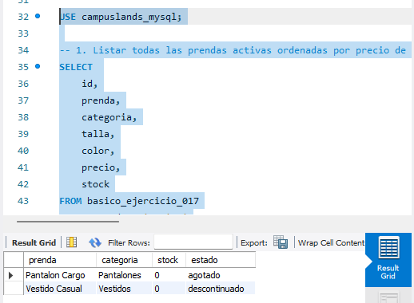
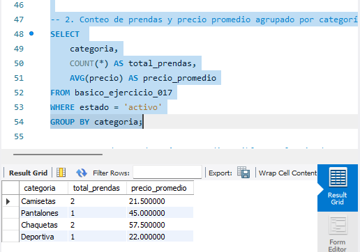
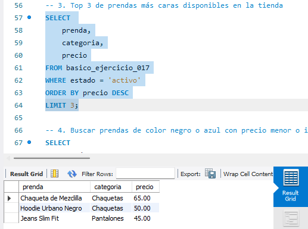
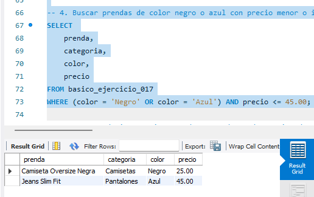
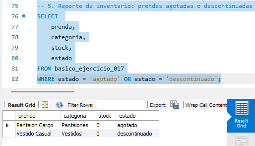

# Solución Ejercicio 017 - Tienda de Ropa (Tipos de Datos)

## Descripción
Solución del ejercicio básico para practicar tipos de datos en MySQL (`VARCHAR`, `DECIMAL`, `INT`, `ENUM`) aplicados al inventario de una tienda de ropa.

## Pasos para ejecutar
1. Ejecuta `ddl/schema.sql` para crear la tabla de productos de ropa.
2. Ejecuta `dml/inserts.sql` para insertar los registros de prueba.
3. Ejecuta `dql/consultas.sql` para revisar las consultas de negocio.

## consulta 1

## consulta 2

## consulta 3

## consulta 4

## consulta 5

