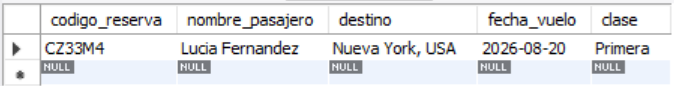
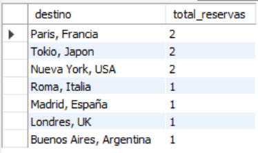
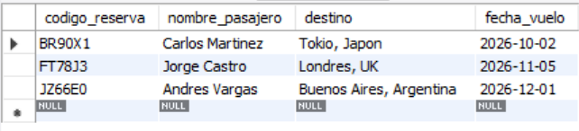
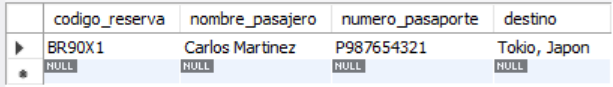
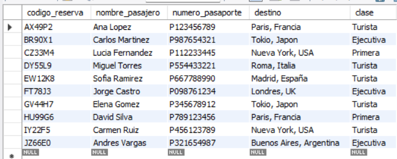

# Ejercicio Básico 018 - PRIMARY KEY

**Camper:** Antonio Canux

## Descripción

Decimoctavo ejercicio de nivel básico, enfocado en un módulo de datos para una agencia de viajes y turismo. El objetivo central de esta práctica es analizar y aplicar correctamente la **`PRIMARY KEY`** (Llave Primaria) en MySQL. Para demostrar madurez profesional, en este ejercicio nos alejamos del clásico `id INT AUTO_INCREMENT` y utilizamos una **Llave Natural**: el código de reserva o PNR (ej. 'AX49P2'). La llave primaria garantiza dos reglas universales de integridad: cada registro debe ser único (no puede haber dos reservas con el mismo código) y no puede ser nulo (`NOT NULL`).

---

## Tabla utilizada

**basico_ejercicio_018_reservas**
- codigo_reserva (VARCHAR 6, PRIMARY KEY)
- nombre_pasajero (VARCHAR)
- numero_pasaporte (VARCHAR, UNIQUE)
- destino (VARCHAR)
- fecha_vuelo (DATE)
- clase (ENUM)

---

## Consultas realizadas

### 1. ¿Cómo realizar una búsqueda ultrarrápida del estado de un vuelo usando el código de reserva (PK)?

```sql
SELECT codigo_reserva, nombre_pasajero, destino, fecha_vuelo, clase 
    FROM basico_ejercicio_018_reservas 
    WHERE codigo_reserva = 'CZ33M4';
```

**Resultado**



---

### 2. ¿Cuántas reservaciones existen por cada destino turístico?

```sql
SELECT destino, COUNT(codigo_reserva) AS total_reservas 
    FROM basico_ejercicio_018_reservas 
    GROUP BY destino 
    ORDER BY total_reservas DESC;
```

**Resultado**



---

### 3. ¿Quiénes son los pasajeros que viajan en clase 'Ejecutiva', ordenados por la fecha de su vuelo?

```sql
SELECT codigo_reserva, nombre_pasajero, destino, fecha_vuelo 
    FROM basico_ejercicio_018_reservas 
    WHERE clase = 'Ejecutiva' 
    ORDER BY fecha_vuelo ASC;
```

**Resultado**



---

### 4. ¿Cómo buscar una reserva usando el pasaporte (llave candidata) en lugar de la llave primaria?

```sql
SELECT codigo_reserva, nombre_pasajero, numero_pasaporte, destino 
    FROM basico_ejercicio_018_reservas 
    WHERE numero_pasaporte = 'P987654321';
```

**Resultado**



---

### 5. ¿Cuál es el listado general de itinerarios ordenados alfabéticamente por su Llave Primaria?

```sql
SELECT codigo_reserva, nombre_pasajero, numero_pasaporte, destino, clase 
    FROM basico_ejercicio_018_reservas 
    ORDER BY codigo_reserva ASC;
```

*(Nota técnica: El script DQL incluye la documentación sobre cómo la base de datos rechaza automáticamente cualquier intento de insertar un `codigo_reserva` duplicado gracias a la restricción PRIMARY KEY).*

**Resultado**



---

## Herramientas

- MySQL
- MySQL Workbench
- Git
- GitHub

---

**Campuslands · Skill SQL**