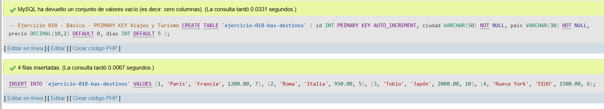
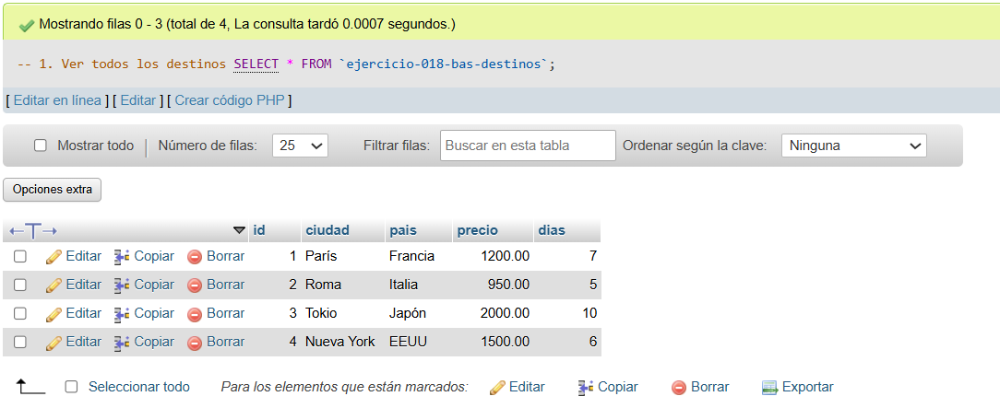
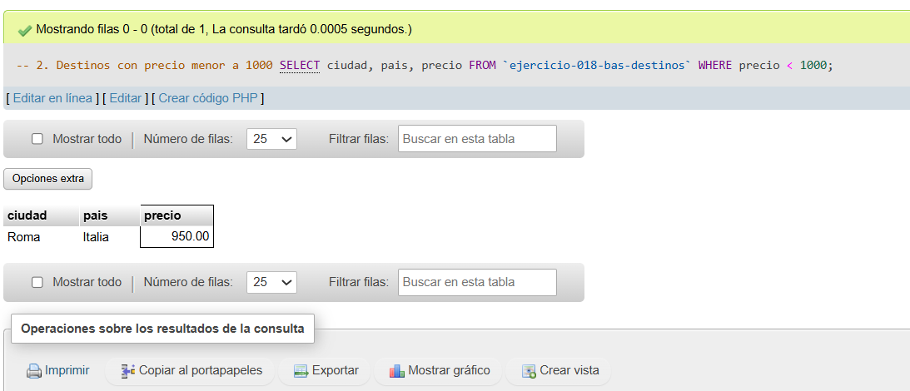
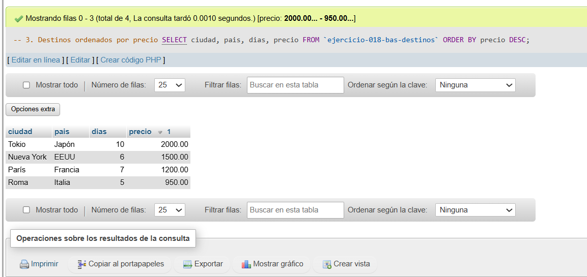

# Ejercicio 018 - Nivel Básico - PRIMARY KEY Viajes y Turismo

## 1. Temática

Viajes y turismo con PRIMARY KEY AUTO_INCREMENT para identificar destinos.

## 2. Decisiones Técnicas

- **Diseño de Tablas (DDL):**
  - Una tabla: `ejercicio-018-bas-destinos`.
  - PRIMARY KEY en `id` con AUTO_INCREMENT.
  - Columnas: `id`, `ciudad`, `pais`, `precio`, `dias`.
  - Uso de comillas invertidas para nombres con guiones.

- **Inserción de Datos (DML):**
  - 4 destinos con diferentes precios y días.

- **Consultas (DQL):**
  - La consulta `1` muestra todos los destinos.
  - La consulta `2` filtra destinos con precio menor a 1000.
  - La consulta `3` ordena destinos por precio descendente.

## 3. Evidencias

<!-- Capturas aquí -->

*A continuación, se adjuntan capturas de pantalla que demuestran la ejecución y los resultados de los scripts SQL en phpMyAdmin.*

Definición de tablas e inserción de datos

Consulta 1

Consulta 2

Consulta 3

