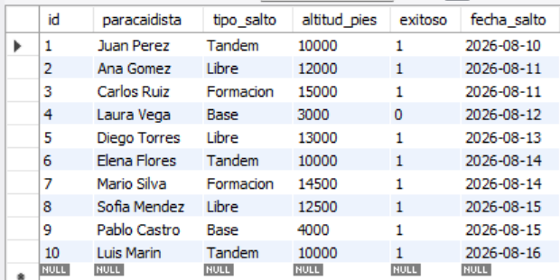
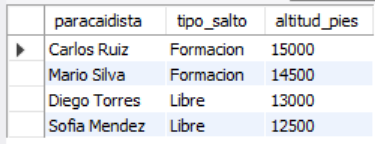
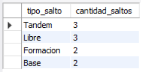
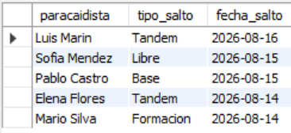

# Ejercicio Básico 019 - INSERT

**Camper:** Antonio Canux

## Descripción

Decimonoveno ejercicio de nivel básico, aplicado a un módulo de datos de paracaidismo. El objetivo de esta práctica es dominar la sentencia **`INSERT`** en MySQL. A nivel profesional, la carga de datos puede realizarse de diversas maneras dependiendo de la necesidad. En el archivo DML demostramos tres métodos fundamentales: inserción básica (un registro a la vez), inserción múltiple (bulk insert) que es altamente eficiente para reducir llamadas al servidor, e inserción omitiendo columnas que poseen un valor `DEFAULT` en su definición (DDL), dejando que el motor de base de datos lo asigne automáticamente.

---

## Tabla utilizada

**basico_ejercicio_019_saltos**
- id (INT, PK, AUTO_INCREMENT)
- paracaidista (VARCHAR)
- tipo_salto (ENUM: 'Tandem', 'Libre', 'Base', 'Formacion')
- altitud_pies (INT)
- exitoso (BOOLEAN, DEFAULT TRUE)
- fecha_salto (DATE)

---

## Consultas realizadas

### 1. ¿Cuál es el registro histórico completo de saltos tras ejecutar las inserciones?

```sql
SELECT id, paracaidista, tipo_salto, altitud_pies, exitoso, fecha_salto 
    FROM basico_ejercicio_019_saltos;
```

**Resultado**



---

### 2. ¿Cuáles fueron los saltos extremos ejecutados a más de 12,000 pies de altitud?

```sql
SELECT paracaidista, tipo_salto, altitud_pies 
    FROM basico_ejercicio_019_saltos 
    WHERE altitud_pies > 12000 
    ORDER BY altitud_pies DESC;
```

**Resultado**



---

### 3. ¿Cómo se distribuyen estadísticamente los saltos según la modalidad practicada?

```sql
SELECT tipo_salto, COUNT(id) AS cantidad_saltos 
    FROM basico_ejercicio_019_saltos 
    GROUP BY tipo_salto 
    ORDER BY cantidad_saltos DESC;
```

**Resultado**



---

### 4. ¿Existe registro de alguna incidencia (saltos no exitosos)?

```sql
SELECT paracaidista, tipo_salto, altitud_pies, fecha_salto 
    FROM basico_ejercicio_019_saltos 
    WHERE exitoso = FALSE;
```

**Resultado**


---

### 5. ¿Cuáles son los 5 saltos más recientes registrados cronológicamente?

```sql
SELECT paracaidista, tipo_salto, fecha_salto 
    FROM basico_ejercicio_019_saltos 
    ORDER BY fecha_salto DESC 
    LIMIT 5;
```

**Resultado**



---

## Herramientas

- MySQL
- MySQL Workbench
- Git
- GitHub

---

**Campuslands · Skill SQL**