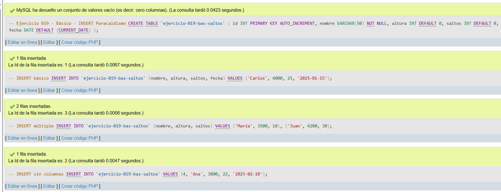
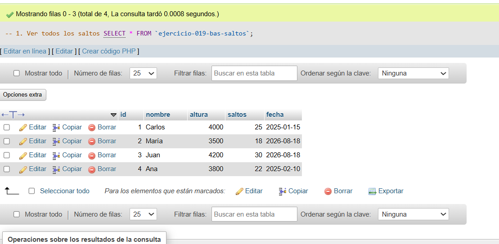
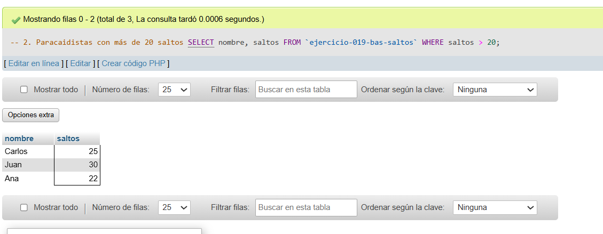
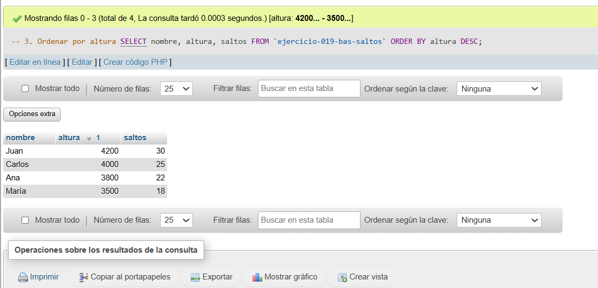

# Ejercicio 019 - Nivel Básico - INSERT Paracaidismo

## 1. Temática

Paracaidismo con diferentes formas de INSERT para gestionar saltos.

## 2. Decisiones Técnicas

- **Diseño de Tablas (DDL):**
  - Una tabla: `ejercicio-019-bas-saltos`.
  - Columnas: `id`, `nombre`, `altura`, `saltos`, `fecha`.
  - PRIMARY KEY en `id` con AUTO_INCREMENT.
  - Uso de comillas invertidas para nombres con guiones.

- **Inserción de Datos (DML):**
  - 3 formas de INSERT:
    - INSERT básico con columnas.
    - INSERT múltiple.
    - INSERT sin columnas.

- **Consultas (DQL):**
  - La consulta `1` muestra todos los saltos.
  - La consulta `2` filtra por más de 20 saltos.
  - La consulta `3` ordena por altura descendente.

## 3. Evidencias

<!-- Capturas aquí -->

*A continuación, se adjuntan capturas de pantalla que demuestran la ejecución y los resultados de los scripts SQL en phpMyAdmin.*

Definición de tablas e inserción de datos

Consulta 1

Consulta 2

Consulta 3

