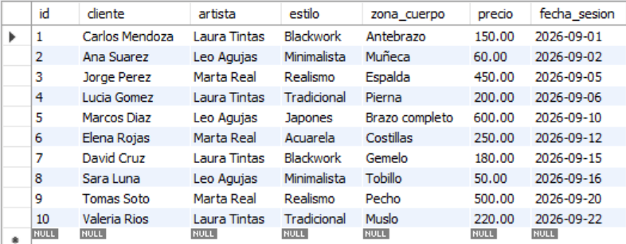
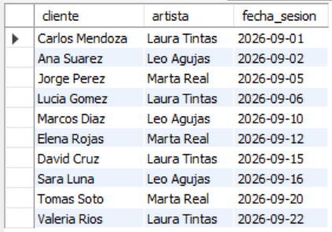
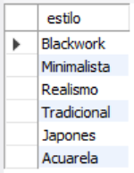
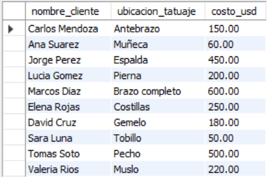
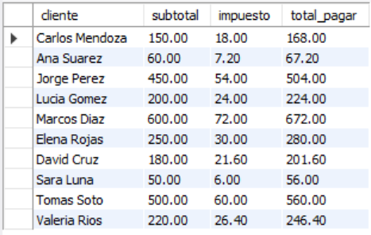

# Ejercicio Básico 020 - SELECT

**Camper:** Antonio Canux

## Descripción

Vigésimo ejercicio de nivel básico, aplicado a un módulo de datos de un estudio de tatuajes. El objetivo central de esta práctica es dominar la sentencia de consulta fundamental en SQL: el **`SELECT`**. A nivel profesional, rara vez usamos `SELECT *` en producción; por ello, este ejercicio demuestra cómo proyectar columnas específicas, eliminar duplicados en la visualización con `DISTINCT`, renombrar campos temporalmente usando Alias (`AS`) y generar columnas calculadas al vuelo (como el cálculo de impuestos) directamente en la proyección de la consulta.

---

## Tabla utilizada

**basico_ejercicio_020_tatuajes**
- id (INT, PK)
- cliente (VARCHAR)
- artista (VARCHAR)
- estilo (ENUM)
- zona_cuerpo (VARCHAR)
- precio (DECIMAL 6,2)
- fecha_sesion (DATE)

---

## Consultas realizadas

### 1. ¿Cómo extraer la información completa de todo el registro de tatuajes?

```sql
SELECT * FROM basico_ejercicio_020_tatuajes;
```

**Resultado**



---

### 2. ¿Cómo extraer únicamente la información necesaria para revisar la agenda de citas?

```sql
SELECT cliente, artista, fecha_sesion 
    FROM basico_ejercicio_020_tatuajes;
```

**Resultado**



---

### 3. ¿Cuáles son los estilos únicos de tatuaje que se han realizado en el estudio? (`DISTINCT`)

```sql
SELECT DISTINCT estilo 
FROM basico_ejercicio_020_tatuajes;
```

**Resultado**



---

### 4. ¿Cómo renombrar las columnas en el resultado para presentarlas de forma más amigable? (`AS`)

```sql
SELECT cliente AS nombre_cliente, zona_cuerpo AS ubicacion_tatuaje, precio AS costo_usd 
FROM basico_ejercicio_020_tatuajes;
```

**Resultado**



---

### 5. ¿Cómo calcular el total a pagar incluyendo un 12% de impuesto proyectando la matemática en el `SELECT`?

```sql
SELECT cliente, precio AS subtotal, ROUND(precio * 0.12, 2) AS impuesto, ROUND(precio * 1.12, 2) AS total_pagar
FROM basico_ejercicio_020_tatuajes;
```

**Resultado**



---

## Herramientas

- MySQL
- MySQL Workbench
- Git
- GitHub

---

**Campuslands · Skill SQL**