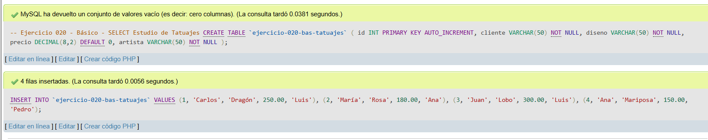
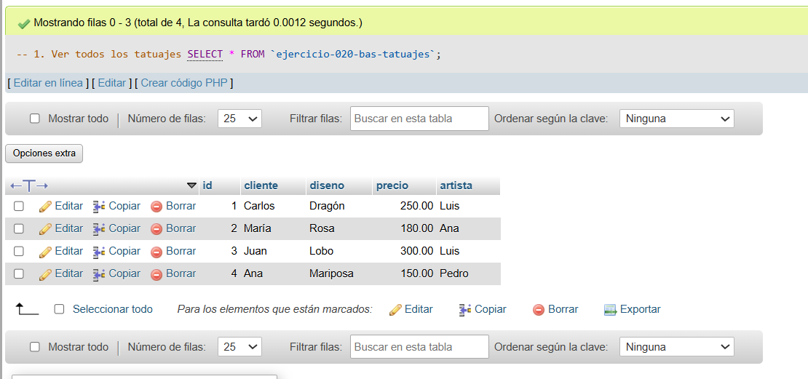
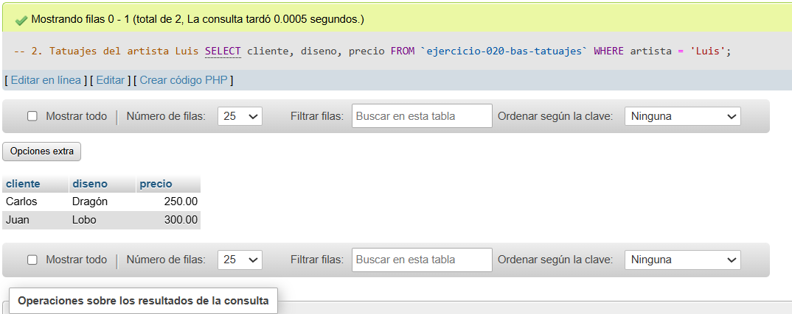
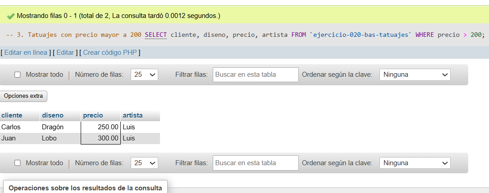

# Ejercicio 020 - Nivel Básico - SELECT Estudio de Tatuajes

## 1. Temática

Estudio de tatuajes con consultas SELECT básicas para gestionar trabajos.

## 2. Decisiones Técnicas

- **Diseño de Tablas (DDL):**
  - Una tabla: `ejercicio-020-bas-tatuajes`.
  - Columnas: `id`, `cliente`, `diseno`, `precio`, `artista`.
  - PRIMARY KEY en `id` con AUTO_INCREMENT.
  - Uso de comillas invertidas para nombres con guiones.

- **Inserción de Datos (DML):**
  - 4 tatuajes con diferentes diseños y precios.

- **Consultas (DQL):**
  - La consulta `1` muestra todos los tatuajes.
  - La consulta `2` filtra tatuajes del artista Luis.
  - La consulta `3` filtra tatuajes con precio mayor a 200.

## 3. Evidencias

<!-- Capturas aquí -->

*A continuación, se adjuntan capturas de pantalla que demuestran la ejecución y los resultados de los scripts SQL en phpMyAdmin.*

Definición de tablas e inserción de datos

Consulta 1

Consulta 2

Consulta 3

