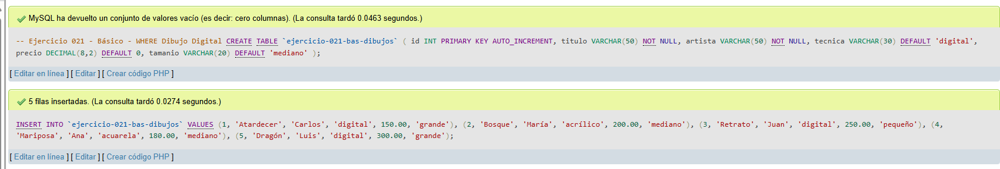
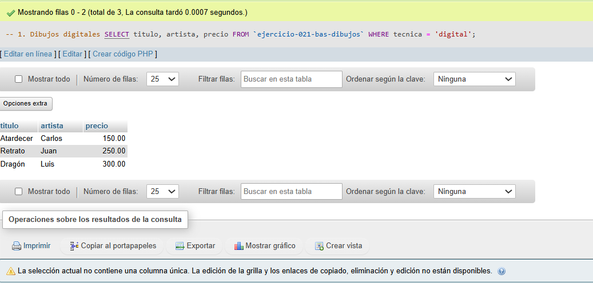
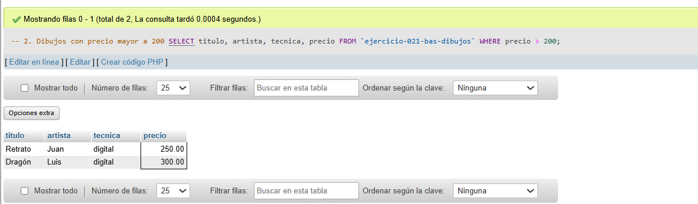
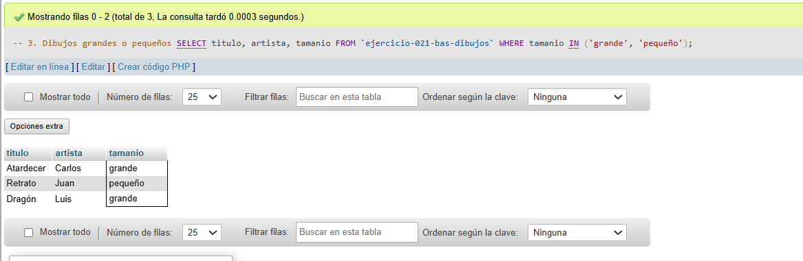

# Ejercicio 021 - Nivel Básico - WHERE Dibujo Digital

## 1. Temática

Dibujo digital con consultas WHERE para filtrar por técnica, precio y tamaño.

## 2. Decisiones Técnicas

- **Diseño de Tablas (DDL):**
  - Una tabla: `ejercicio-021-bas-dibujos`.
  - Columnas: `id`, `titulo`, `artista`, `tecnica`, `precio`, `tamanio`.
  - PRIMARY KEY en `id` con AUTO_INCREMENT.
  - Uso de comillas invertidas para nombres con guiones.

- **Inserción de Datos (DML):**
  - 5 dibujos con diferentes técnicas y precios.

- **Consultas (DQL):**
  - La consulta `1` filtra dibujos digitales.
  - La consulta `2` filtra dibujos con precio mayor a 200.
  - La consulta `3` filtra dibujos grandes o pequeños con IN.

## 3. Evidencias

<!-- Capturas aquí -->

*A continuación, se adjuntan capturas de pantalla que demuestran la ejecución y los resultados de los scripts SQL en phpMyAdmin.*

Definición de tablas e inserción de datos

Consulta 1

Consulta 2

Consulta 3

