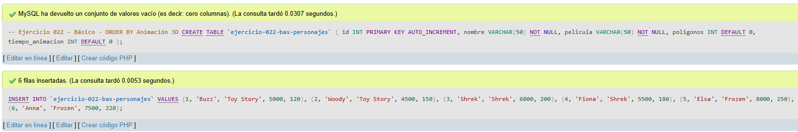
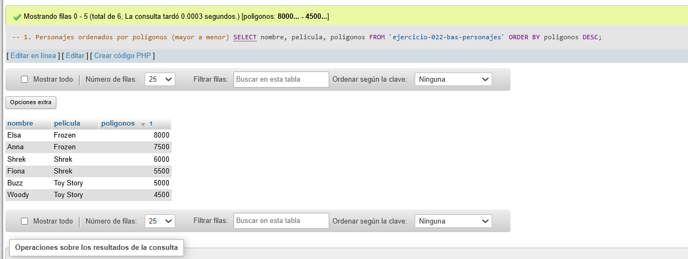
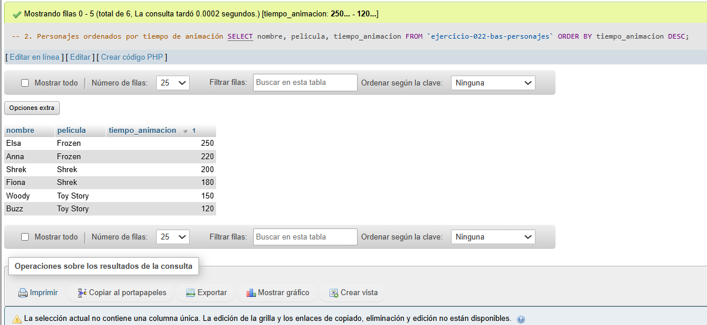
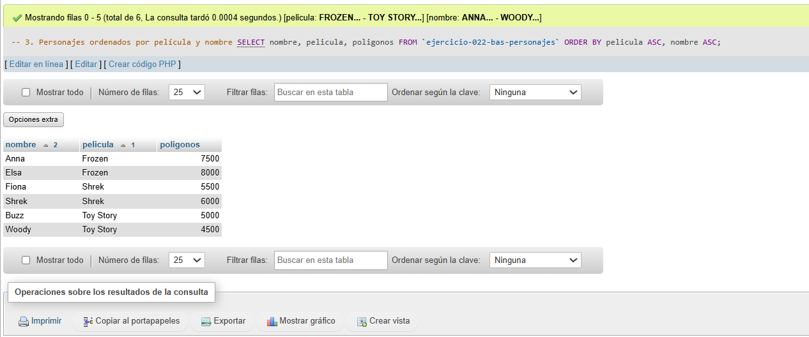

# Ejercicio 022 - Nivel Básico - ORDER BY Animación 3D

## 1. Temática

Animación 3D con ORDER BY para ordenar personajes por diferentes criterios.

## 2. Decisiones Técnicas

- **Diseño de Tablas (DDL):**
  - Una tabla: `ejercicio-022-bas-personajes`.
  - Columnas: `id`, `nombre`, `pelicula`, `poligonos`, `tiempo_animacion`.
  - PRIMARY KEY en `id` con AUTO_INCREMENT.
  - Uso de comillas invertidas para nombres con guiones.

- **Inserción de Datos (DML):**
  - 6 personajes de 3 películas diferentes.

- **Consultas (DQL):**
  - La consulta `1` ordena por polígonos de mayor a menor.
  - La consulta `2` ordena por tiempo de animación de mayor a menor.
  - La consulta `3` ordena por película y luego por nombre.

## 3. Evidencias

<!-- Capturas aquí -->

*A continuación, se adjuntan capturas de pantalla que demuestran la ejecución y los resultados de los scripts SQL en phpMyAdmin.*

Definición de tablas e inserción de datos

Consulta 1

Consulta 2

Consulta 3

