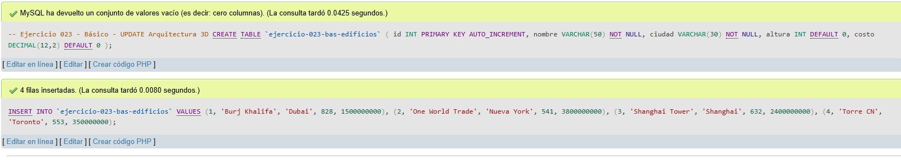
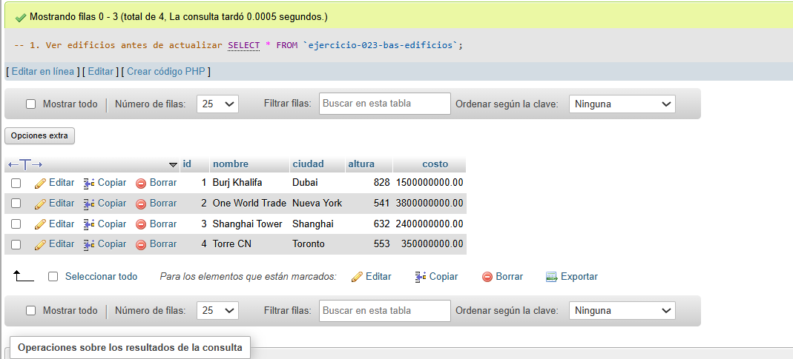
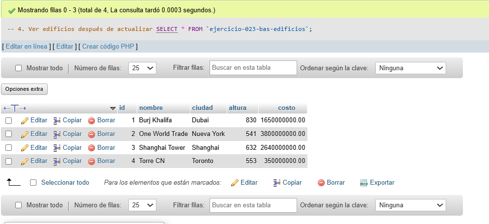
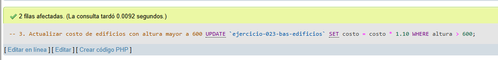

# Ejercicio 023 - Nivel Básico - UPDATE Arquitectura 3D

## 1. Temática

Arquitectura 3D con operaciones UPDATE para modificar datos de edificios.

## 2. Decisiones Técnicas

- **Diseño de Tablas (DDL):**
  - Una tabla: `ejercicio-023-bas-edificios`.
  - Columnas: `id`, `nombre`, `ciudad`, `altura`, `costo`.
  - PRIMARY KEY en `id` con AUTO_INCREMENT.
  - Uso de comillas invertidas para nombres con guiones.

- **Inserción de Datos (DML):**
  - 4 edificios famosos con diferentes alturas y costos.

- **Consultas (DQL):**
  - La consulta `1` muestra todos los edificios antes de actualizar.
  - La consulta `2` actualiza la altura de un edificio específico.
  - La consulta `3` actualiza el costo de edificios con altura mayor a 600.
  - La consulta `4` muestra los edificios después de las actualizaciones.

## 3. Evidencias

<!-- Capturas aquí -->

*A continuación, se adjuntan capturas de pantalla que demuestran la ejecución y los resultados de los scripts SQL en phpMyAdmin.*

Definición de tablas e inserción de datos

Vista 1

Vista 2

Vista 3

