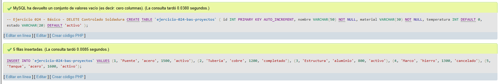
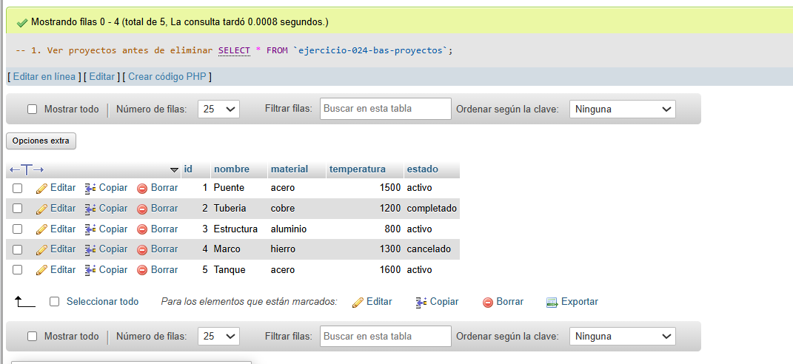
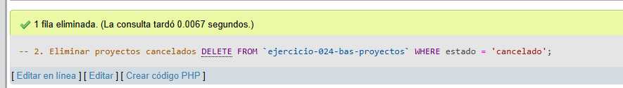
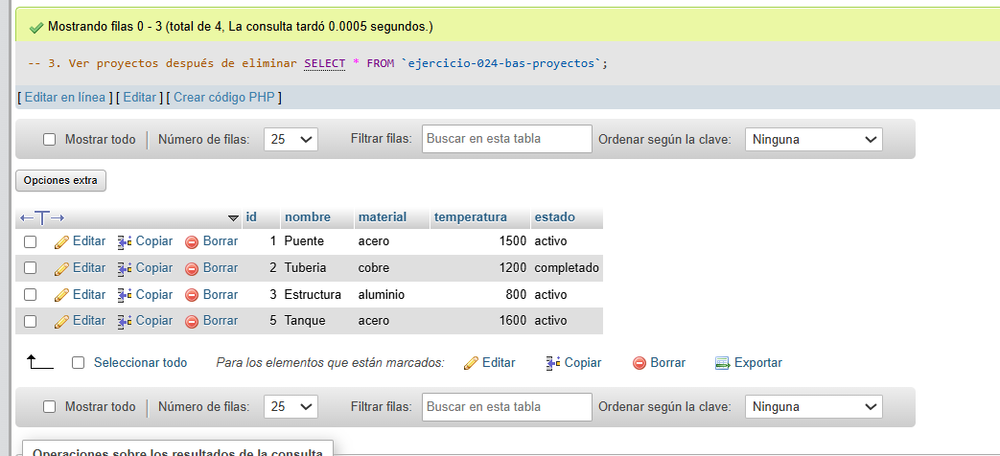

# Ejercicio 024 - Nivel Básico - DELETE Controlado Soldadura

## 1. Temática

Soldadura con DELETE controlado para eliminar proyectos según estado.

## 2. Decisiones Técnicas

- **Diseño de Tablas (DDL):**
  - Una tabla: `ejercicio-024-bas-proyectos`.
  - Columnas: `id`, `nombre`, `material`, `temperatura`, `estado`.
  - PRIMARY KEY en `id` con AUTO_INCREMENT.
  - Uso de comillas invertidas para nombres con guiones.

- **Inserción de Datos (DML):**
  - 5 proyectos con diferentes materiales y estados.

- **Consultas (DQL):**
  - La consulta `1` muestra todos los proyectos.
  - La consulta `2` elimina proyectos con estado 'cancelado'.
  - La consulta `3` verifica los proyectos restantes.

## 3. Evidencias

<!-- Capturas aquí -->

*A continuación, se adjuntan capturas de pantalla que demuestran la ejecución y los resultados de los scripts SQL en phpMyAdmin.*

Definición de tablas e inserción de datos

Consulta 1

Consulta 2

Consulta 3

