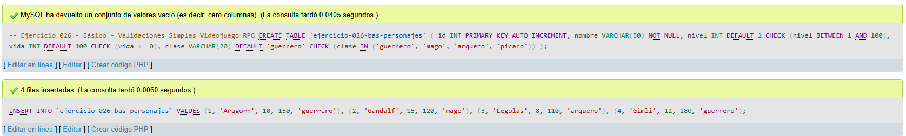
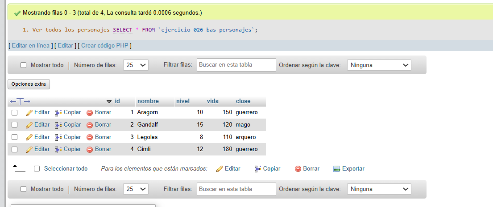
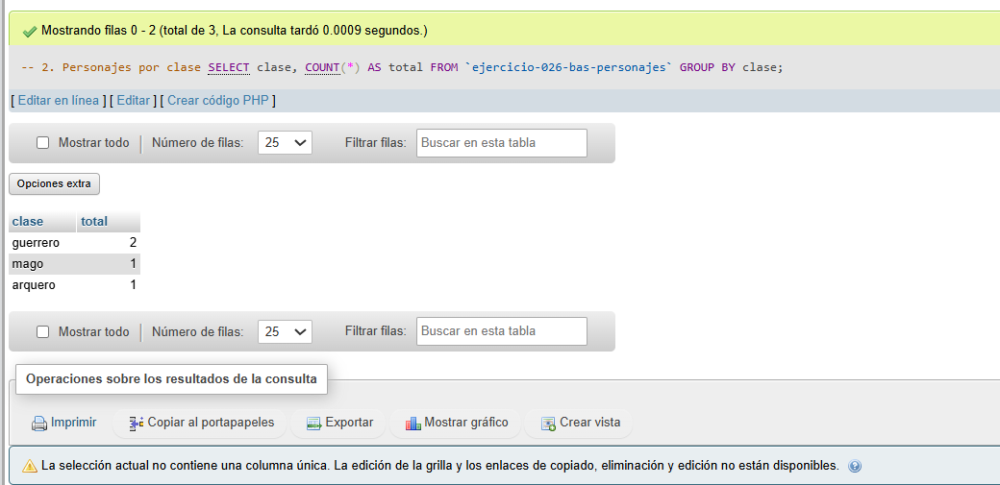
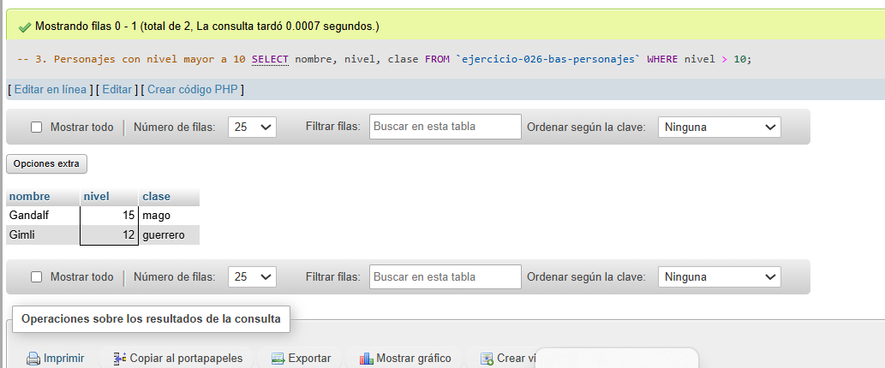

# Ejercicio 026 - Nivel Básico - Validaciones Simples Videojuego RPG

## 1. Temática

Videojuego RPG con validaciones CHECK para garantizar datos correctos.

## 2. Decisiones Técnicas

- **Diseño de Tablas (DDL):**
  - Una tabla: `ejercicio-026-bas-personajes`.
  - Columnas: `id`, `nombre`, `nivel`, `vida`, `clase`.
  - CHECK en `nivel` (1-100).
  - CHECK en `vida` (>=0).
  - CHECK en `clase` (4 valores permitidos).
  - PRIMARY KEY en `id` con AUTO_INCREMENT.
  - Uso de comillas invertidas para nombres con guiones.

- **Inserción de Datos (DML):**
  - 4 personajes con diferentes clases y niveles.

- **Consultas (DQL):**
  - La consulta `1` muestra todos los personajes.
  - La consulta `2` agrupa por clase.
  - La consulta `3` filtra por nivel mayor a 10.

## 3. Evidencias

<!-- Capturas aquí -->

*A continuación, se adjuntan capturas de pantalla que demuestran la ejecución y los resultados de los scripts SQL en phpMyAdmin.*

Definición de tablas e inserción de datos

Consulta 1

Consulta 2

Consulta 3

