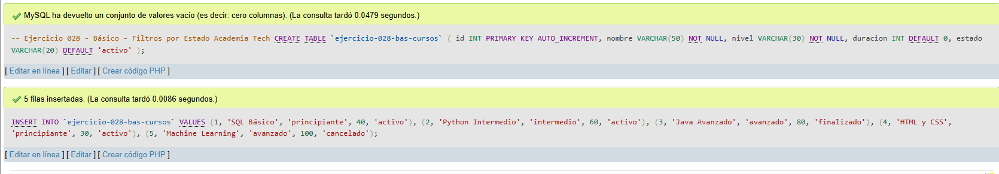
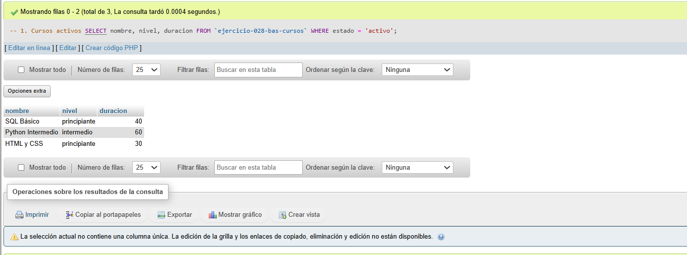
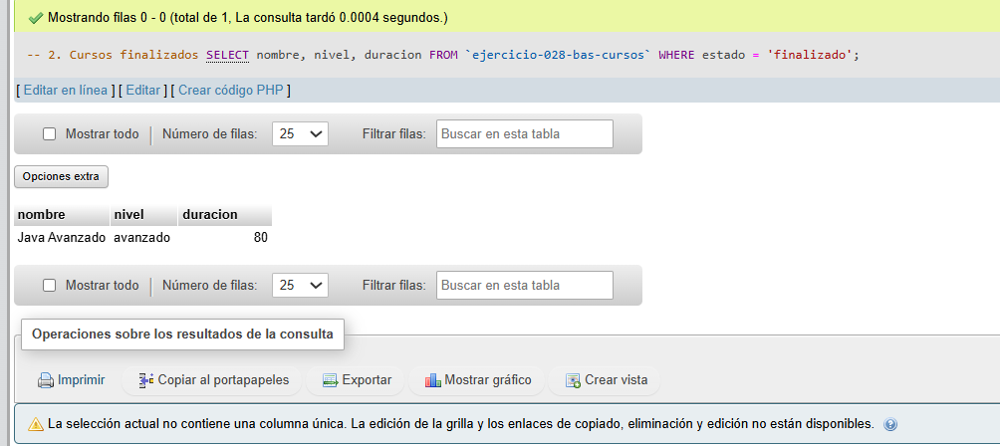
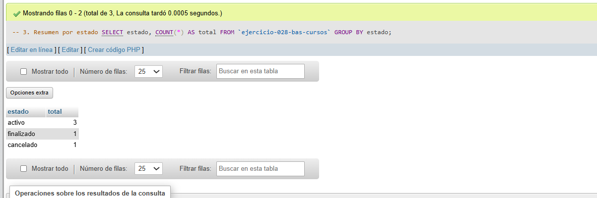

# Ejercicio 028 - Nivel Básico - Filtros por Estado Academia Tech

## 1. Temática

Academia tech con filtros por estado para gestionar cursos.

## 2. Decisiones Técnicas

- **Diseño de Tablas (DDL):**
  - Una tabla: `ejercicio-028-bas-cursos`.
  - Columnas: `id`, `nombre`, `nivel`, `duracion`, `estado`.
  - PRIMARY KEY en `id` con AUTO_INCREMENT.
  - Uso de comillas invertidas para nombres con guiones.

- **Inserción de Datos (DML):**
  - 5 cursos con diferentes estados.

- **Consultas (DQL):**
  - La consulta `1` filtra cursos activos.
  - La consulta `2` filtra cursos finalizados.
  - La consulta `3` agrupa por estado.

## 3. Evidencias

<!-- Capturas aquí -->

*A continuación, se adjuntan capturas de pantalla que demuestran la ejecución y los resultados de los scripts SQL en phpMyAdmin.*

Definición de tablas e inserción de datos

Consulta 1

Consulta 2

Consulta 3

