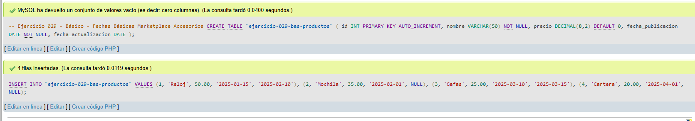
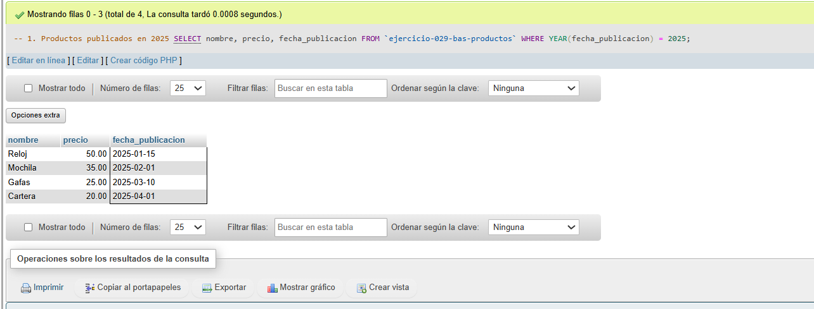
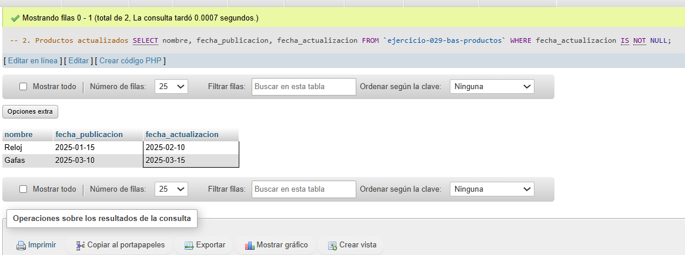
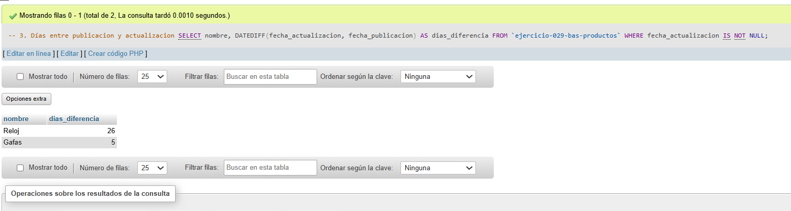

# Ejercicio 029 - Nivel Básico - Fechas Básicas Marketplace Accesorios

## 1. Temática

Marketplace de accesorios con fechas para gestionar publicaciones y actualizaciones.

## 2. Decisiones Técnicas

- **Diseño de Tablas (DDL):**
  - Una tabla: `ejercicio-029-bas-productos`.
  - Columnas: `id`, `nombre`, `precio`, `fecha_publicacion`, `fecha_actualizacion`.
  - PRIMARY KEY en `id` con AUTO_INCREMENT.
  - Uso de comillas invertidas para nombres con guiones.

- **Inserción de Datos (DML):**
  - 4 productos con fechas de publicación y actualización.

- **Consultas (DQL) - Funciones de fecha:**
  - La consulta `1` usa YEAR() para filtrar por año.
  - La consulta `2` filtra productos actualizados.
  - La consulta `3` usa DATEDIFF() para calcular días entre fechas.

## 3. Evidencias

<!-- Capturas aquí -->

*A continuación, se adjuntan capturas de pantalla que demuestran la ejecución y los resultados de los scripts SQL en phpMyAdmin.*

Definición de tablas e inserción de datos

Consulta 1

Consulta 2

Consulta 3

