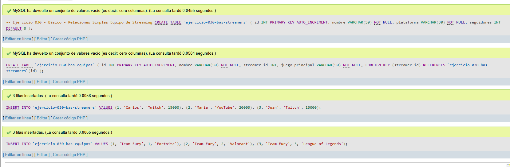
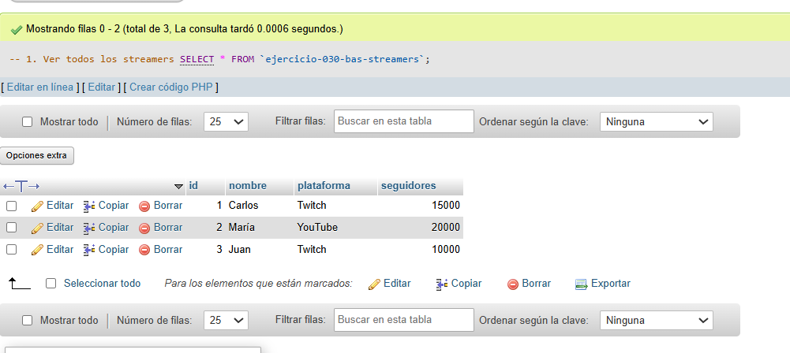
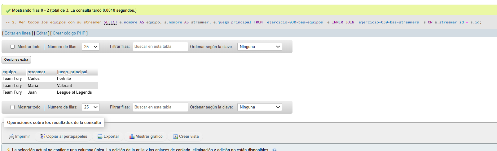
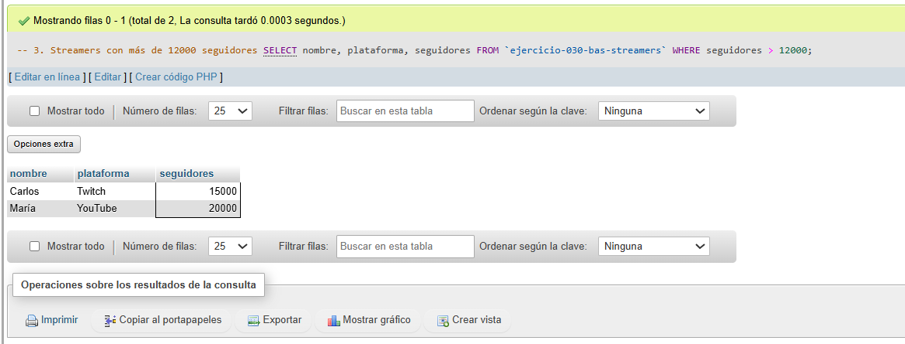

# Ejercicio 030 - Nivel Básico - Relaciones Simples Equipo de Streaming

## 1. Temática

Equipo de streaming con relaciones simples entre streamers y equipos.

## 2. Decisiones Técnicas

- **Diseño de Tablas (DDL):**
  - Tabla de streamers: `ejercicio-030-bas-streamers`.
  - Tabla de equipos: `ejercicio-030-bas-equipos`.
  - FOREIGN KEY en `streamer_id` → `streamers(id)`.
  - Uso de comillas invertidas para nombres con guiones.

- **Inserción de Datos (DML):**
  - 3 streamers con diferentes plataformas.
  - 3 equipos relacionados.

- **Consultas (DQL):**
  - La consulta `1` muestra todos los streamers.
  - La consulta `2` usa INNER JOIN para mostrar equipos con streamers.
  - La consulta `3` filtra streamers con más de 12000 seguidores.

## 3. Evidencias

<!-- Capturas aquí -->

*A continuación, se adjuntan capturas de pantalla que demuestran la ejecución y los resultados de los scripts SQL en phpMyAdmin.*

Definición de tablas e inserción de datos

Consulta 1

Consulta 2

Consulta 3

