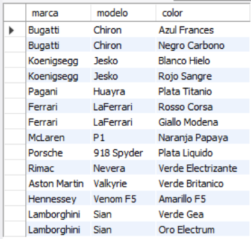
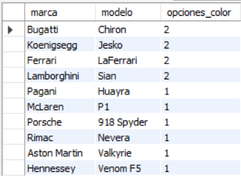
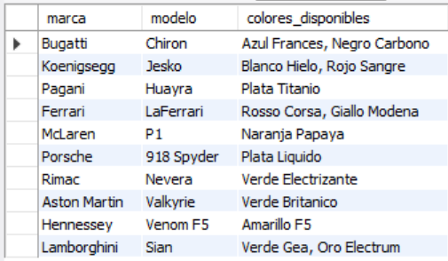
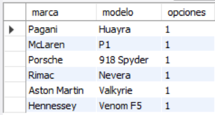

# Ejercicio Intermedio 006 - Normalización 1FN

**Camper:** Antonio Canux

## Descripción

Sexto ejercicio de nivel intermedio, enfocado en un módulo de datos de autos hiperdeportivos. El objetivo de esta práctica es aplicar la **Primera Forma Normal (1FN)**. En lugar de almacenar múltiples valores en una sola columna (ej. una lista de colores separada por comas en la tabla de autos), se atomiza la información creando una tabla relacionada secundaria (`colores`), garantizando que cada registro contenga un valor único e indivisible.

---

## Tablas utilizadas

**intermedio_ejercicio_006_autos**
- id (PK)
- marca
- modelo
- precio
- creado_en

**intermedio_ejercicio_006_colores**
- id (PK)
- auto_id (FK)
- color

---

## Consultas realizadas

### 1. ¿Cuál es el listado detallado de hiperdeportivos y sus colores individuales?

```sql
SELECT a.marca, a.modelo, c.color FROM intermedio_ejercicio_006_autos a JOIN intermedio_ejercicio_006_colores c ON a.id = c.auto_id;
```

**Resultado**



---

### 2. ¿Cuántas opciones de color existen por cada modelo?

```sql
SELECT a.marca, a.modelo, COUNT(c.id) AS opciones_color FROM intermedio_ejercicio_006_autos a JOIN intermedio_ejercicio_006_colores c ON a.id = c.auto_id GROUP BY a.id, a.marca, a.modelo ORDER BY opciones_color DESC;
```

**Resultado**



---

### 3. ¿Qué hiperdeportivos se ofrecen en alguna variante de color verde?

```sql
SELECT a.marca, a.modelo, c.color FROM intermedio_ejercicio_006_autos a JOIN intermedio_ejercicio_006_colores c ON a.id = c.auto_id WHERE c.color LIKE '%Verde%';
```

**Resultado**


---

### 4. ¿Cómo reconstruir la lista de colores en un solo campo (atributo multivaluado) para generar un reporte?

```sql
SELECT a.marca, a.modelo, GROUP_CONCAT(c.color SEPARATOR ', ') AS colores_disponibles FROM intermedio_ejercicio_006_autos a JOIN intermedio_ejercicio_006_colores c ON a.id = c.auto_id GROUP BY a.id, a.marca, a.modelo;
```

**Resultado**



---

### 5. ¿Qué modelos son tan exclusivos que solo cuentan con 1 única opción de color registrada?

```sql
SELECT a.marca, a.modelo, COUNT(c.id) AS opciones FROM intermedio_ejercicio_006_autos a JOIN intermedio_ejercicio_006_colores c ON a.id = c.auto_id GROUP BY a.id, a.marca, a.modelo HAVING opciones = 1;
```

**Resultado**



---

## Herramientas

- MySQL
- MySQL Workbench
- Git
- GitHub

---

**Campuslands · Skill SQL**