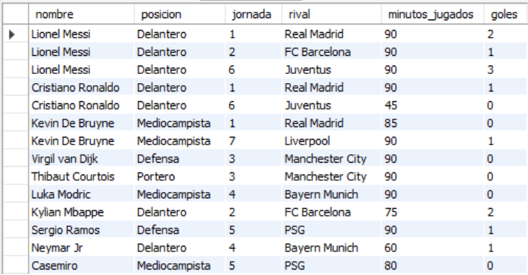
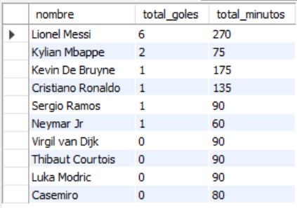
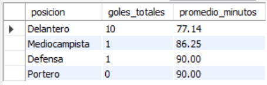
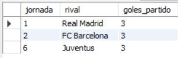
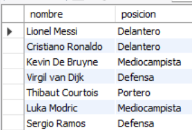

# Ejercicio Intermedio 007 - Normalización 2FN

**Camper:** Antonio Canux

## Descripción

Séptimo ejercicio de nivel intermedio, enfocado en un módulo de datos para estadísticas de una liga de fútbol. El objetivo es aplicar la **Segunda Forma Normal (2FN)**. Para cumplir esta regla, eliminamos las dependencias parciales de una clave primaria compuesta. En lugar de tener una tabla gigante con los datos del jugador y del partido repetidos en cada registro de estadística, separamos las entidades fuertes (`jugadores` y `partidos`) y las relacionamos a través de una tabla transaccional/intermedia (`rendimiento`) que utiliza una llave compuesta `(jugador_id, partido_id)`. Las métricas de goles y minutos dependen completamente de esta llave compuesta.

---

## Tablas utilizadas

**intermedio_ejercicio_007_jugadores**
- id (PK)
- nombre
- posicion

**intermedio_ejercicio_007_partidos**
- id (PK)
- jornada
- rival
- fecha

**intermedio_ejercicio_007_rendimiento**
- jugador_id (PK, FK)
- partido_id (PK, FK)
- minutos_jugados
- goles

---

## Consultas realizadas

### 1. ¿Cuál es el detalle completo de rendimiento cruzando jugadores, partidos y estadísticas?

```sql
SELECT j.nombre, j.posicion, p.jornada, p.rival, r.minutos_jugados, r.goles 
    FROM intermedio_ejercicio_007_rendimiento r 
    JOIN intermedio_ejercicio_007_jugadores j ON r.jugador_id = j.id 
    JOIN intermedio_ejercicio_007_partidos p ON r.partido_id = p.id;
```

**Resultado**



---

### 2. ¿Cuál es el total de goles y minutos jugados acumulados por cada jugador en el torneo?

```sql
SELECT j.nombre, SUM(r.goles) AS total_goles, SUM(r.minutos_jugados) AS total_minutos 
    FROM intermedio_ejercicio_007_jugadores j 
    JOIN intermedio_ejercicio_007_rendimiento r ON j.id = r.jugador_id 
    GROUP BY j.id, j.nombre 
    ORDER BY total_goles DESC, total_minutos DESC;
```

**Resultado**



---

### 3. ¿Cuál es el rendimiento ofensivo (goles) y promedio de minutos agrupado por posición?

```sql
SELECT j.posicion, SUM(r.goles) AS goles_totales, ROUND(AVG(r.minutos_jugados), 2) AS promedio_minutos 
    FROM intermedio_ejercicio_007_jugadores j 
    JOIN intermedio_ejercicio_007_rendimiento r ON j.id = r.jugador_id 
    GROUP BY j.posicion 
    ORDER BY goles_totales DESC;
```

**Resultado**



---

### 4. ¿En qué partidos nuestros jugadores acumularon 2 o más goles en conjunto?

```sql
SELECT p.jornada, p.rival, SUM(r.goles) AS goles_partido 
    FROM intermedio_ejercicio_007_partidos p 
    JOIN intermedio_ejercicio_007_rendimiento r ON p.id = r.partido_id 
    GROUP BY p.id, p.jornada, p.rival 
    HAVING goles_partido >= 2 
    ORDER BY goles_partido DESC;
```

**Resultado**



---

### 5. ¿Qué jugadores han disputado al menos un partido completo de 90 minutos?

```sql
SELECT DISTINCT j.nombre, j.posicion 
    FROM intermedio_ejercicio_007_jugadores j 
    JOIN intermedio_ejercicio_007_rendimiento r ON j.id = r.jugador_id 
    WHERE r.minutos_jugados = 90;
```

**Resultado**



---

## Herramientas

- MySQL
- MySQL Workbench
- Git
- GitHub

---

**Campuslands · Skill SQL**