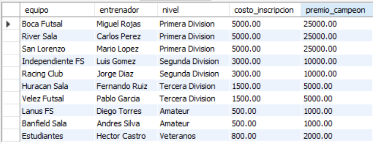
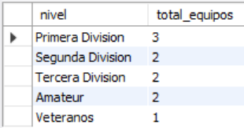
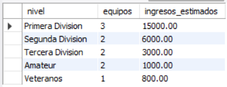
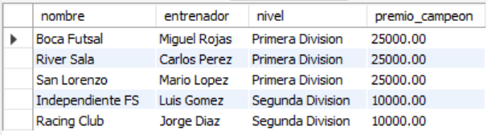
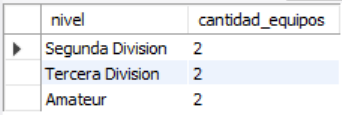

# Ejercicio Intermedio 008 - Normalización 3FN

**Camper:** Antonio Canux

## Descripción

Octavo ejercicio de nivel intermedio, enfocado en un módulo de datos para una liga de fútbol sala. El objetivo principal de esta práctica es aplicar la **Tercera Forma Normal (3FN)**. Para cumplir con este principio, se eliminan las dependencias transitivas: atributos como `costo_inscripcion` o `premio_campeon` dependen lógicamente de la "Categoría" y no del "Equipo". Por ello, se extraen a una tabla independiente (`categorias`), vinculándola a la tabla `equipos` mediante una llave foránea (`categoria_id`), evitando la redundancia y posibles anomalías de actualización.

---

## Tablas utilizadas

**intermedio_ejercicio_008_categorias**
- id (PK)
- nivel
- costo_inscripcion
- premio_campeon

**intermedio_ejercicio_008_equipos**
- id (PK)
- nombre
- entrenador
- categoria_id (FK)
- creado_en

---

## Consultas realizadas

### 1. ¿Cuál es el listado de equipos cruzado con los detalles económicos de su categoría?

```sql
SELECT e.nombre AS equipo, e.entrenador, c.nivel, c.costo_inscripcion, c.premio_campeon 
    FROM intermedio_ejercicio_008_equipos e 
    JOIN intermedio_ejercicio_008_categorias c ON e.categoria_id = c.id;
```

**Resultado**



---

### 2. ¿Cuántos equipos hay inscritos actualmente por cada nivel de competición?

```sql
SELECT c.nivel, COUNT(e.id) AS total_equipos 
    FROM intermedio_ejercicio_008_categorias c 
    LEFT JOIN intermedio_ejercicio_008_equipos e ON c.id = e.categoria_id 
    GROUP BY c.id, c.nivel 
    ORDER BY total_equipos DESC;
```

**Resultado**



---

### 3. ¿Cuál es la proyección de ingresos totales por inscripciones, agrupada por categoría?

```sql
SELECT c.nivel, COUNT(e.id) AS equipos, (COUNT(e.id) * c.costo_inscripcion) AS ingresos_estimados 
    FROM intermedio_ejercicio_008_categorias c 
    JOIN intermedio_ejercicio_008_equipos e ON c.id = e.categoria_id 
    GROUP BY c.id, c.nivel, c.costo_inscripcion 
    ORDER BY ingresos_estimados DESC;
```

**Resultado**



---

### 4. ¿Qué equipos participan en categorías donde el premio al campeón supera los 5,000?

```sql
SELECT e.nombre, e.entrenador, c.nivel, c.premio_campeon 
    FROM intermedio_ejercicio_008_equipos e 
    JOIN intermedio_ejercicio_008_categorias c ON e.categoria_id = c.id 
    WHERE c.premio_campeon > 5000 
    ORDER BY c.premio_campeon DESC;
```

**Resultado**



---

### 5. ¿Qué categorías tienen exactamente 2 equipos inscritos en este momento?

```sql
SELECT c.nivel, COUNT(e.id) AS cantidad_equipos 
    FROM intermedio_ejercicio_008_categorias c 
    JOIN intermedio_ejercicio_008_equipos e ON c.id = e.categoria_id 
    GROUP BY c.id, c.nivel 
    HAVING cantidad_equipos = 2;
```

**Resultado**



---

## Herramientas

- MySQL
- MySQL Workbench
- Git
- GitHub

---

**Campuslands · Skill SQL**