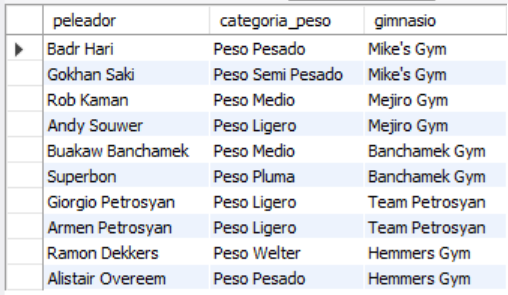
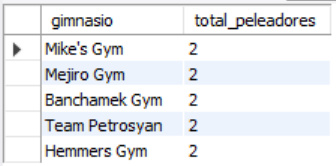
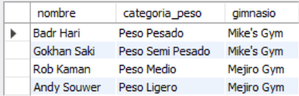
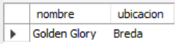
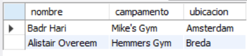

# Ejercicio Intermedio 009 - FOREIGN KEY

**Camper:** Antonio Canux

## Descripción

Noveno ejercicio de nivel intermedio, enfocado en un módulo de datos de kickboxing. El objetivo fundamental de esta práctica es implementar y explotar la restricción `FOREIGN KEY` (Llave Foránea) en MySQL. Para lograrlo, se establecieron dos entidades: Gimnasios y Peleadores, donde cada peleador debe pertenecer estrictamente a un gimnasio registrado, garantizando la integridad referencial de los datos.

---

## Tablas utilizadas

**intermedio_ejercicio_009_gimnasios**
- id (PK)
- nombre
- ubicacion
- creado_en

**intermedio_ejercicio_009_peleadores**
- id (PK)
- nombre
- categoria_peso
- gimnasio_id (FK)
- creado_en

---

## Consultas realizadas

### 1. ¿Cuál es el listado general de peleadores indicando el gimnasio que representan?

```sql
SELECT p.nombre AS peleador, p.categoria_peso, g.nombre AS gimnasio 
    FROM intermedio_ejercicio_009_peleadores p 
    JOIN intermedio_ejercicio_009_gimnasios g ON p.gimnasio_id = g.id;
```

**Resultado**



---

### 2. ¿Cuántos peleadores hay registrados por cada campamento/gimnasio?

```sql
SELECT g.nombre AS gimnasio, COUNT(p.id) AS total_peleadores 
    FROM intermedio_ejercicio_009_gimnasios g 
    JOIN intermedio_ejercicio_009_peleadores p ON g.id = p.gimnasio_id 
    GROUP BY g.id, g.nombre 
    ORDER BY total_peleadores DESC;
```

**Resultado**



---

### 3. ¿Qué peleadores realizan sus entrenamientos en gimnasios ubicados en 'Amsterdam'?

```sql
SELECT p.nombre, p.categoria_peso, g.nombre AS gimnasio 
    FROM intermedio_ejercicio_009_peleadores p 
    JOIN intermedio_ejercicio_009_gimnasios g ON p.gimnasio_id = g.id 
    WHERE g.ubicacion = 'Amsterdam';
```

**Resultado**



---

### 4. ¿Cuáles gimnasios registrados no tienen peleadores asignados en este momento?

```sql
SELECT g.nombre, g.ubicacion 
    FROM intermedio_ejercicio_009_gimnasios g 
    LEFT JOIN intermedio_ejercicio_009_peleadores p ON g.id = p.gimnasio_id 
    WHERE p.id IS NULL;
```

**Resultado**



---

### 5. ¿Cuál es el listado de pesos pesados y de qué campamento provienen?

```sql
SELECT p.nombre, g.nombre AS campamento, g.ubicacion 
    FROM intermedio_ejercicio_009_peleadores p 
    JOIN intermedio_ejercicio_009_gimnasios g ON p.gimnasio_id = g.id 
    WHERE p.categoria_peso = 'Peso Pesado';
```

**Resultado**



---

## Herramientas

- MySQL
- MySQL Workbench
- Git
- GitHub

---

**Campuslands · Skill SQL**