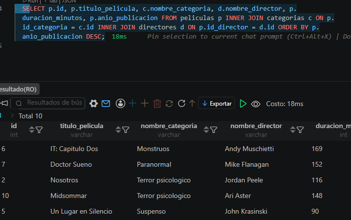

## Ejercicio 013- intermedio

## Description
En este ejericio se ha generado una base de datos en donde se hace utilidad de tablas puentes, los cuales son aquellas que no generan relacion directa con otras ejemplo: tabla `pedidos` con `productos` seria  `pedidos` -> `detalles_pedido` <- `productos`

ejemplo de la consulta:
```sql
SELECT  p.id, p.titulo_pelicula, 
        c.nombre_categoria, 
        d.nombre_director, 
        p.duracion_minutos,
        p.anio_publicacion 
FROM peliculas p 
INNER JOIN categorias c ON p.id_categoria = c.id 
INNER JOIN directores d ON p.id_director = d.id 
ORDER BY p.anio_publicacion DESC;
```
resultado:

