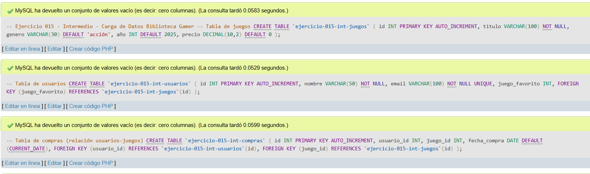
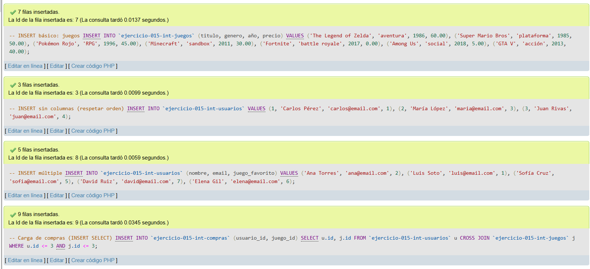
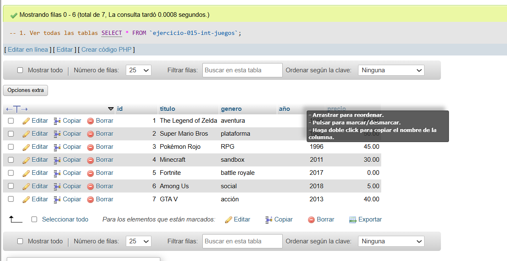
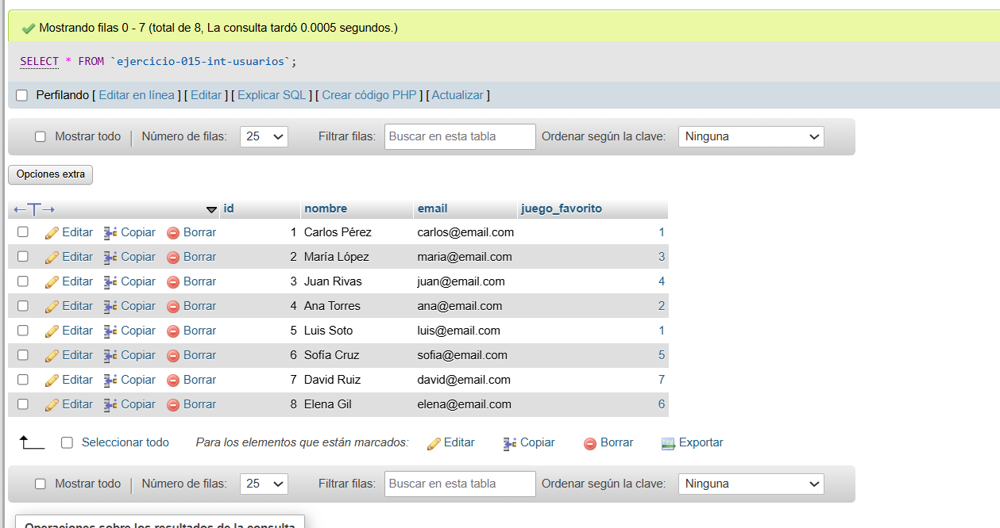
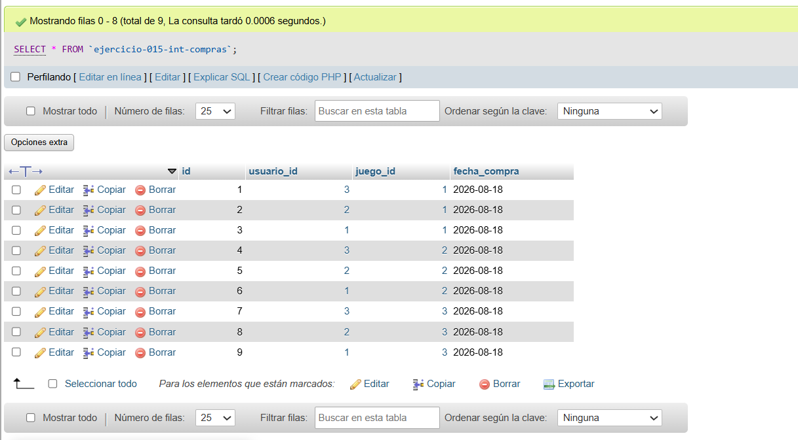
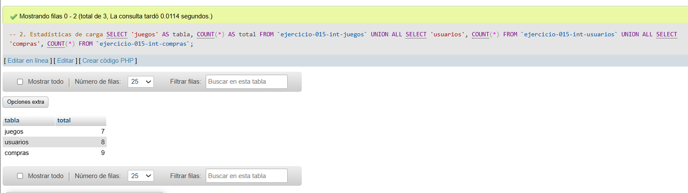
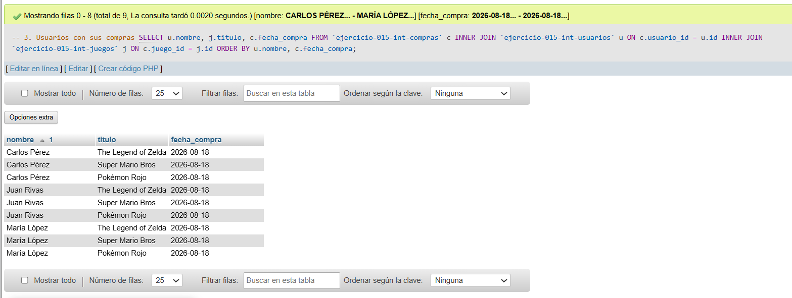
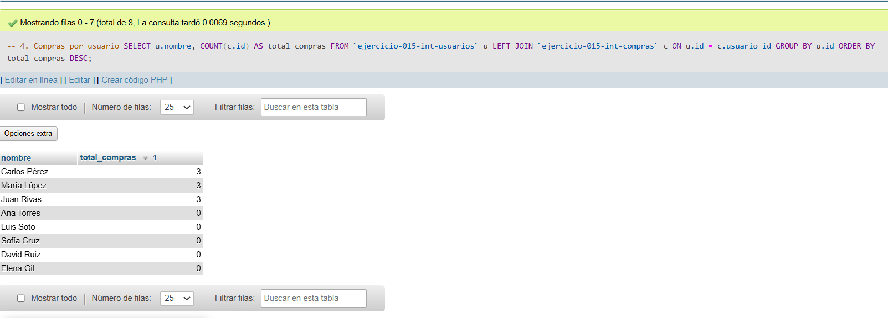
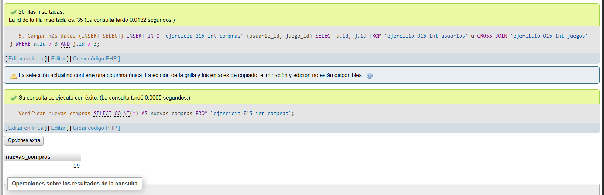

# Ejercicio 015 - Nivel Intermedio - Carga de Datos Biblioteca Gamer

## 1. Temática

Biblioteca gamer con diferentes métodos de carga de datos en tablas relacionadas.

## 2. Decisiones Técnicas

- **Diseño de Tablas (DDL):**
  - 3 tablas relacionadas: `juegos`, `usuarios`, `compras`.
  - FOREIGN KEY para integridad referencial.
  - UNIQUE en email para evitar duplicados.
  - Uso de comillas invertidas para nombres con guiones.

- **Métodos de carga:**
  - **INSERT básico:** Insertar juegos uno por uno.
  - **INSERT sin columnas:** Respetar orden de columnas.
  - **INSERT múltiple:** Varios usuarios en una sentencia.
  - **INSERT SELECT:** Cargar compras desde otras tablas.
  - **CROSS JOIN:** Combinar usuarios con juegos para compras.

- **Inserción de Datos (DML):**
  - 7 juegos.
  - 8 usuarios (3 con INSERT sin columnas, 5 con INSERT múltiple).
  - Compras generadas con INSERT SELECT.

- **Consultas (DQL):**
  - Ver todas las tablas.
  - Estadísticas de carga con UNION.
  - Usuarios con sus compras (JOIN).
  - Conteo de compras por usuario.
  - Carga adicional con INSERT SELECT.

## 3. Evidencias

*A continuación, se adjuntan capturas de pantalla que demuestran la ejecución y los resultados de los scripts SQL en phpMyAdmin.*

Definición de tablas

Insertar datos

Consulta 1.1

Consulta 1.2

Consulta 1.3

Consulta 2

Consulta 3

Consulta 4

Consulta 5
