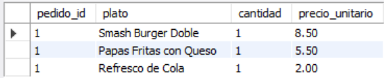
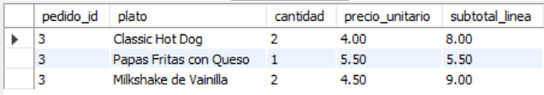
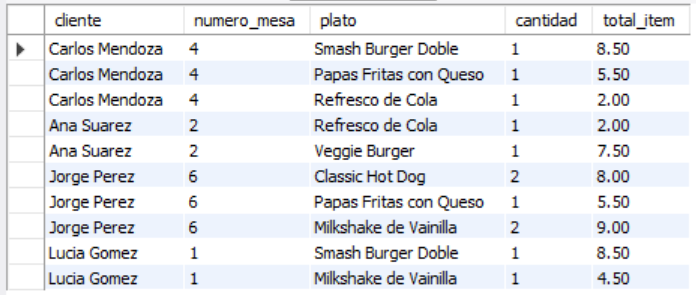
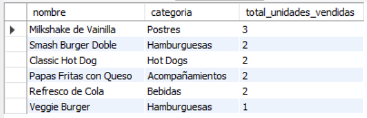
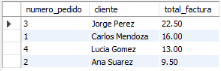

# Ejercicio Intermedio 016 - INNER JOIN

**Camper:** Antonio Canux

## Descripción

Decimosexto ejercicio de nivel intermedio, enfocado en un módulo de datos para un restaurante de comida urbana. El objetivo técnico central es dominar la cláusula **`INNER JOIN`**. Esta operación es el corazón de las bases de datos relacionales, ya que permite combinar registros de dos o más tablas basándose en una condición lógica (generalmente cruzando llaves primarias y foráneas). El `INNER JOIN` es estricto: solo devuelve las filas donde exista una coincidencia en ambas tablas, garantizando la consistencia de los reportes.

---

## Tablas utilizadas

**intermedio_ejercicio_016_platos**
- id (PK)
- nombre
- categoria
- precio

**intermedio_ejercicio_016_pedidos**
- id (PK)
- cliente
- numero_mesa
- fecha_pedido

**intermedio_ejercicio_016_pedido_detalles** (Tabla Puente)
- pedido_id (FK, PK)
- plato_id (FK, PK)
- cantidad
- precio_unitario

---

## Consultas realizadas

### 1. ¿Cómo listar los platos exactos que conforman el pedido #1 usando un `INNER JOIN` de 2 tablas?

```sql
SELECT pd.pedido_id, p.nombre AS plato, pd.cantidad, pd.precio_unitario 
    FROM intermedio_ejercicio_016_pedido_detalles pd
    INNER JOIN intermedio_ejercicio_016_platos p ON pd.plato_id = p.id
    WHERE pd.pedido_id = 1;
```

**Resultado**



---

### 2. ¿Cómo calcular el subtotal de cada línea de un pedido cruzando el catálogo de platos?

```sql
SELECT pd.pedido_id, p.nombre AS plato, pd.cantidad, pd.precio_unitario, (pd.cantidad * pd.precio_unitario) AS subtotal_linea
    FROM intermedio_ejercicio_016_pedido_detalles pd
    INNER JOIN intermedio_ejercicio_016_platos p ON pd.plato_id = p.id
    WHERE pd.pedido_id = 3;
```

**Resultado**



---

### 3. ¿Cómo generar un "recibo completo" uniendo información del cliente, su mesa y los platos (`INNER JOIN` de 3 tablas)?

```sql
SELECT pe.cliente, pe.numero_mesa, p.nombre AS plato, pd.cantidad, (pd.cantidad * pd.precio_unitario) AS total_item
    FROM intermedio_ejercicio_016_pedidos pe
    INNER JOIN intermedio_ejercicio_016_pedido_detalles pd ON pe.id = pd.pedido_id
    INNER JOIN intermedio_ejercicio_016_platos p ON pd.plato_id = p.id
    ORDER BY pe.id ASC;
```

**Resultado**



---

### 4. ¿Cuáles son los platos más vendidos en la historia del restaurante combinando `JOIN` y agrupaciones?

```sql
SELECT p.nombre, p.categoria, SUM(pd.cantidad) AS total_unidades_vendidas
    FROM intermedio_ejercicio_016_platos p
    INNER JOIN intermedio_ejercicio_016_pedido_detalles pd ON p.id = pd.plato_id
    GROUP BY p.id, p.nombre, p.categoria
    ORDER BY total_unidades_vendidas DESC;
```

**Resultado**



---

### 5. ¿Cuál es el monto total facturado por cada pedido en el sistema?

```sql
SELECT pe.id AS numero_pedido, pe.cliente, SUM(pd.cantidad * pd.precio_unitario) AS total_factura
    FROM intermedio_ejercicio_016_pedidos pe
    INNER JOIN intermedio_ejercicio_016_pedido_detalles pd ON pe.id = pd.pedido_id
    GROUP BY pe.id, pe.cliente
    ORDER BY total_factura DESC;
```

**Resultado**



---

## Herramientas

- MySQL
- MySQL Workbench
- Git
- GitHub

---

**Campuslands · Skill SQL**