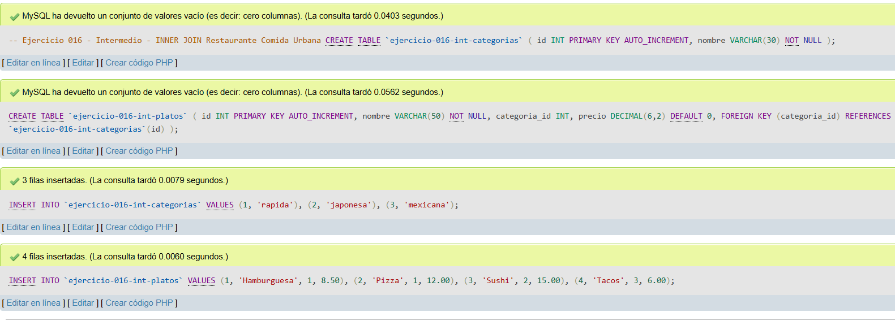
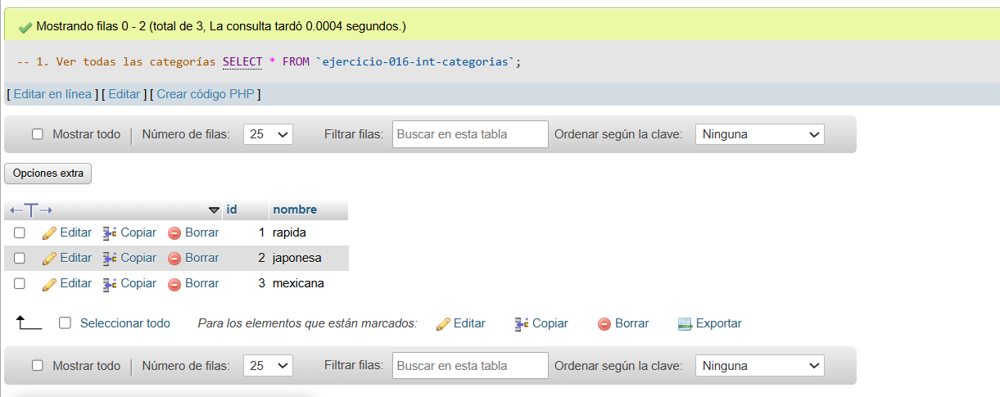
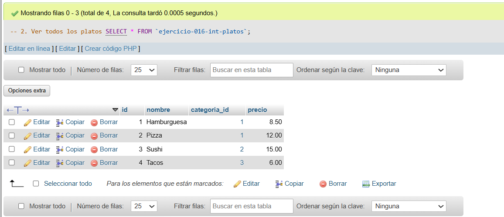
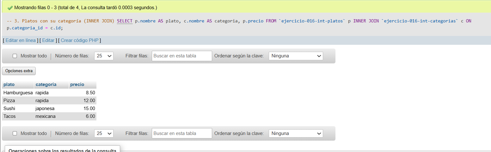

# Ejercicio 016 - Nivel Intermedio - INNER JOIN Restaurante Comida Urbana

## 1. Temática

Restaurante de comida urbana con INNER JOIN para relacionar platos y categorías.

## 2. Decisiones Técnicas

- **Diseño de Tablas (DDL):**
  - Tabla de categorías: `ejercicio-016-int-categorias`.
  - Tabla de platos: `ejercicio-016-int-platos`.
  - FOREIGN KEY en `categoria_id` → `categorias(id)`.
  - Uso de comillas invertidas para nombres con guiones.

- **Inserción de Datos (DML):**
  - 3 categorías.
  - 4 platos con categorías asignadas.

- **Consultas (DQL):**
  - La consulta `1` muestra todas las categorías.
  - La consulta `2` muestra todos los platos.
  - La consulta `3` usa INNER JOIN para mostrar platos con su categoría.

## 3. Evidencias

<!-- Capturas aquí -->

*A continuación, se adjuntan capturas de pantalla que demuestran la ejecución y los resultados de los scripts SQL en phpMyAdmin.*

Definición de tablas e inserción de datos

Consulta 1

Consulta 2

Consulta 3

