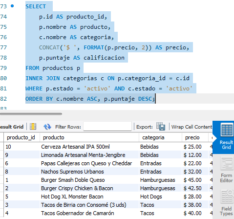
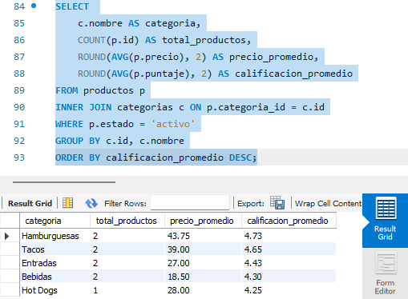
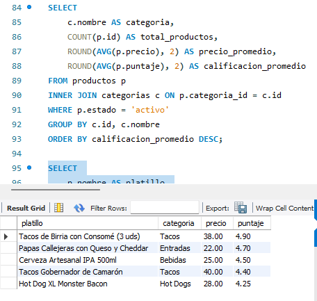
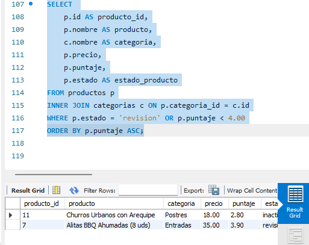
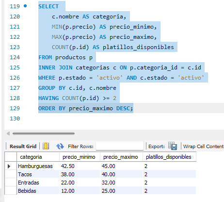

# Solución Ejercicio 016 (Intermedio) - INNER JOIN Restaurante Urbano

## Descripción
Esta solución normaliza el modelo de base de datos del restaurante urbano dividiéndolo en dos entidades relacionables (`categorias` y `productos`) mediante clave foránea (`FOREIGN KEY`) para practicar consultas relacionales con `INNER JOIN`.

## Decisiones Técnicas y Arquitectura
1. **Normalización (1N a 3N)**:
   - Se extrajo el atributo repetitivo `categoria` hacia una tabla independiente `categorias` para reducir redundancia.
   - Relación 1:N entre `categorias` y `productos` con restricción de clave foránea `ON DELETE RESTRICT ON UPDATE CASCADE`.
2. **Precisiones de Datos y Constraints**:
   - `precio DECIMAL(10,2)` con validación `CHECK (precio >= 0.00)`.
   - `puntaje DECIMAL(3,2)` con validación `CHECK (puntaje BETWEEN 0.00 AND 5.00)`.
3. **Optimización con JOINs**:
   - Todas las consultas DQL combinan atributos clave de ambas entidades garantizando integridad referencial.

## Orden de Ejecución
1. `ddl/schema.sql`
2. `dml/inserts.sql`
3. `dql/consultas.sql`

## consulta 1

## consulta 2

## consulta 3

## consulta 4 

## consulta 5

