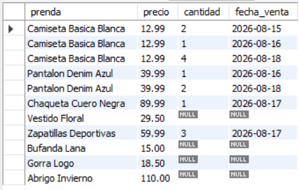
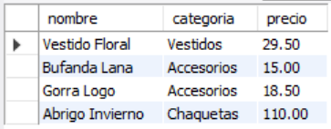
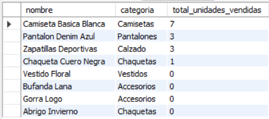
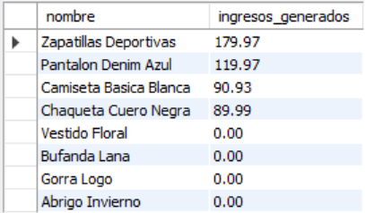
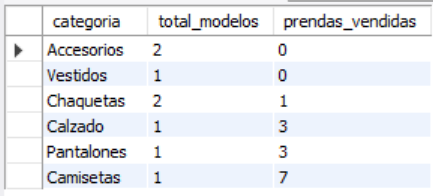

# Ejercicio Intermedio 017 - LEFT JOIN

**Camper:** Antonio Canux

## Descripción

Decimoséptimo ejercicio de nivel intermedio, enfocado en un módulo de datos para una tienda de ropa. El objetivo técnico central es dominar la cláusula **`LEFT JOIN`** (o *Left Outer Join*). A diferencia del `INNER JOIN` (que exige que el dato exista en ambas tablas), el `LEFT JOIN` **siempre** devuelve todos los registros de la "tabla izquierda" (en este caso, el catálogo de prendas), incluso si no tienen coincidencias en la "tabla derecha" (las ventas). Esto es crítico en entornos profesionales para auditorías: nos permite descubrir "inventario muerto" (productos que nunca se han vendido), clientes que nunca han comprado, o cuentas sin actividad, simplemente buscando los valores que retornan como `NULL`.

---

## Tablas utilizadas

**intermedio_ejercicio_017_prendas** (Tabla Izquierda / Principal)
- id (PK)
- nombre
- categoria
- precio

**intermedio_ejercicio_017_ventas** (Tabla Derecha / Secundaria)
- id (PK)
- prenda_id (FK)
- cantidad
- fecha_venta

---

## Consultas realizadas

### 1. ¿Cómo listar todas las prendas del catálogo junto con su historial de ventas (mostrando `NULL` si no tienen ventas)?

```sql
SELECT p.nombre AS prenda, p.precio, v.cantidad, v.fecha_venta
    FROM intermedio_ejercicio_017_prendas p
    LEFT JOIN intermedio_ejercicio_017_ventas v ON p.id = v.prenda_id;
```

**Resultado**



---

### 2. ¿Cómo identificar el "inventario muerto" (prendas que jamás han registrado una venta)?

```sql
SELECT p.nombre, p.categoria, p.precio
    FROM intermedio_ejercicio_017_prendas p
    LEFT JOIN intermedio_ejercicio_017_ventas v ON p.id = v.prenda_id
    WHERE v.id IS NULL;
```

**Resultado**



---

### 3. ¿Cuántas unidades se han vendido de cada prenda, asegurando que las prendas sin ventas muestren un `0` en lugar de `NULL`?

```sql
SELECT p.nombre, p.categoria, IFNULL(SUM(v.cantidad), 0) AS total_unidades_vendidas
    FROM intermedio_ejercicio_017_prendas p
    LEFT JOIN intermedio_ejercicio_017_ventas v ON p.id = v.prenda_id
    GROUP BY p.id, p.nombre, p.categoria
    ORDER BY total_unidades_vendidas DESC;
```

**Resultado**



---

### 4. ¿Cuáles son los ingresos totales generados por cada artículo en el catálogo?

```sql
SELECT p.nombre, IFNULL(SUM(v.cantidad * p.precio), 0.00) AS ingresos_generados
    FROM intermedio_ejercicio_017_prendas p
    LEFT JOIN intermedio_ejercicio_017_ventas v ON p.id = v.prenda_id
    GROUP BY p.id, p.nombre
    ORDER BY ingresos_generados DESC;
```

**Resultado**



---

### 5. ¿Cuál es el resumen de rendimiento por categoría, incluso aquellas que no han vendido nada?

```sql
SELECT p.categoria, COUNT(DISTINCT p.id) AS total_modelos, IFNULL(SUM(v.cantidad), 0) AS prendas_vendidas
    FROM intermedio_ejercicio_017_prendas p
    LEFT JOIN intermedio_ejercicio_017_ventas v ON p.id = v.prenda_id
    GROUP BY p.categoria
    ORDER BY prendas_vendidas ASC;
```

**Resultado**



---

## Herramientas

- MySQL
- MySQL Workbench
- Git
- GitHub

---

**Campuslands · Skill SQL**