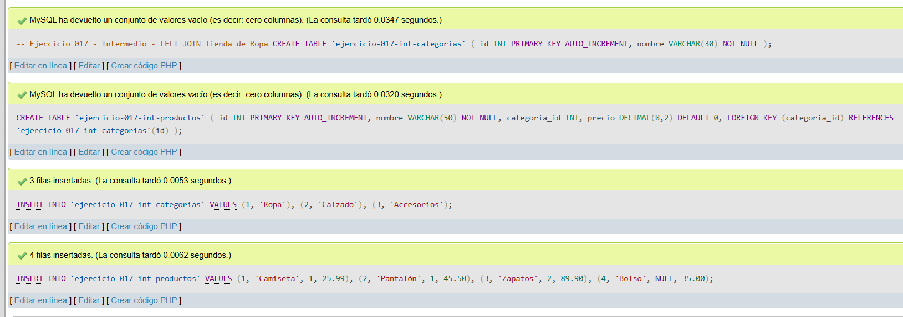
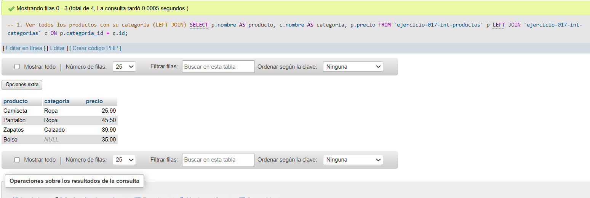
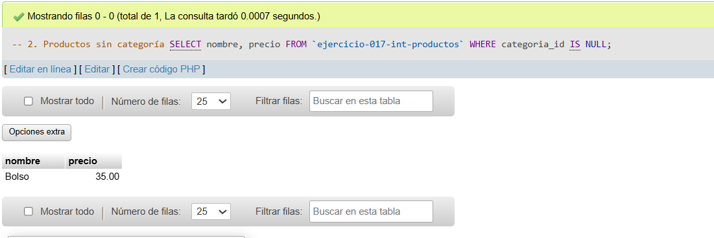
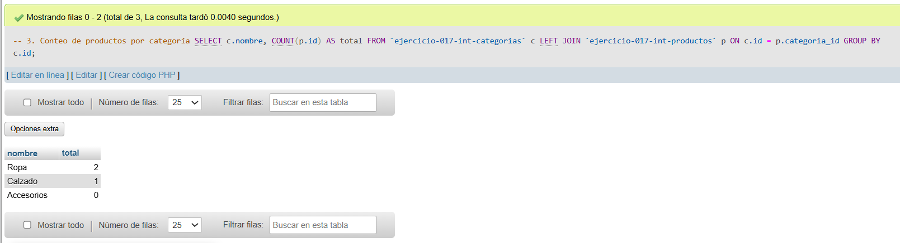

# Ejercicio 017 - Nivel Intermedio - LEFT JOIN Tienda de Ropa

## 1. Temática

Tienda de ropa con LEFT JOIN para mostrar productos con o sin categoría.

## 2. Decisiones Técnicas

- **Diseño de Tablas (DDL):**
  - Tabla de categorías: `ejercicio-017-int-categorias`.
  - Tabla de productos: `ejercicio-017-int-productos`.
  - FOREIGN KEY en `categoria_id` → `categorias(id)`.
  - Uso de comillas invertidas para nombres con guiones.

- **Inserción de Datos (DML):**
  - 3 categorías.
  - 4 productos (1 sin categoría para probar LEFT JOIN).

- **Consultas (DQL):**
  - La consulta `1` usa LEFT JOIN para mostrar todos los productos con su categoría.
  - La consulta `2` filtra productos sin categoría.
  - La consulta `3` cuenta productos por categoría con LEFT JOIN.

## 3. Evidencias

<!-- Capturas aquí -->

*A continuación, se adjuntan capturas de pantalla que demuestran la ejecución y los resultados de los scripts SQL en phpMyAdmin.*

Definición de tablas e inserción de datos

Consulta 1

Consulta 2

Consulta 3

