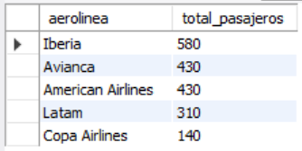
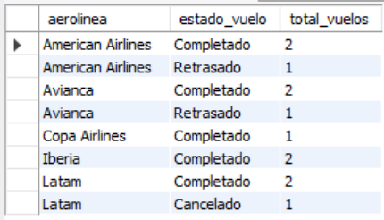
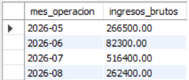

# Ejercicio Intermedio 018 - GROUP BY

**Camper:** Antonio Canux

## Descripción

Decimoctavo ejercicio de nivel intermedio, enfocado en un módulo de datos para viajes y turismo. El objetivo técnico central es dominar la cláusula **`GROUP BY`** en MySQL, junto con las funciones de agregación (`SUM`, `COUNT`, `AVG`) y la cláusula **`HAVING`**. A nivel profesional, `GROUP BY` permite transformar datos transaccionales crudos en reportes estadísticos, agrupando filas que comparten los mismos valores en columnas de resumen, y `HAVING` actúa como el filtro exclusivo para esas agrupaciones matemáticas generadas al vuelo.

---

## Tabla utilizada

**intermedio_ejercicio_018_vuelos**
- id (PK)
- aerolinea
- destino
- estado_vuelo (ENUM)
- pasajeros
- precio_boleto
- fecha_vuelo

---

## Consultas realizadas

### 1. ¿Cuál es el total de pasajeros transportados exitosamente por cada aerolínea?

```sql
SELECT aerolinea, SUM(pasajeros) AS total_pasajeros
    FROM intermedio_ejercicio_018_vuelos
    WHERE estado_vuelo = 'Completado'
    GROUP BY aerolinea
    ORDER BY total_pasajeros DESC;
```

**Resultado**



---

### 2. ¿Cuántos vuelos se han registrado hacia cada destino y cuál es el precio promedio del boleto?

```sql
SELECT destino, COUNT(id) AS cantidad_vuelos, ROUND(AVG(precio_boleto), 2) AS precio_promedio
    FROM intermedio_ejercicio_018_vuelos
    GROUP BY destino
    ORDER BY cantidad_vuelos DESC;
```

**Resultado**


---

### 3. ¿Cómo se desglosa el estatus histórico de las operaciones por aerolínea?

```sql
SELECT aerolinea, estado_vuelo, COUNT(id) AS total_vuelos
    FROM intermedio_ejercicio_018_vuelos
    GROUP BY aerolinea, estado_vuelo
    ORDER BY aerolinea ASC, total_vuelos DESC;
```

**Resultado**



---

### 4. Utilizando `HAVING`: ¿Qué destinos han recibido a más de 300 pasajeros en total?

```sql
SELECT destino, SUM(pasajeros) AS pasajeros_recibidos
    FROM intermedio_ejercicio_018_vuelos
    WHERE estado_vuelo = 'Completado'
    GROUP BY destino
    HAVING SUM(pasajeros) > 300
    ORDER BY pasajeros_recibidos DESC;
```

**Resultado**


---

### 5. ¿Cuáles fueron los ingresos brutos generados por las aerolíneas agrupados por mes operativo?

```sql
SELECT DATE_FORMAT(fecha_vuelo, '%Y-%m') AS mes_operacion, SUM(pasajeros * precio_boleto) AS ingresos_brutos
    FROM intermedio_ejercicio_018_vuelos
    WHERE estado_vuelo = 'Completado'
    GROUP BY mes_operacion
    ORDER BY mes_operacion ASC;
```

**Resultado**



---

## Herramientas

- MySQL
- MySQL Workbench
- Git
- GitHub

---

**Campuslands · Skill SQL**