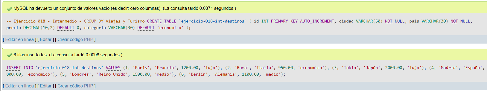
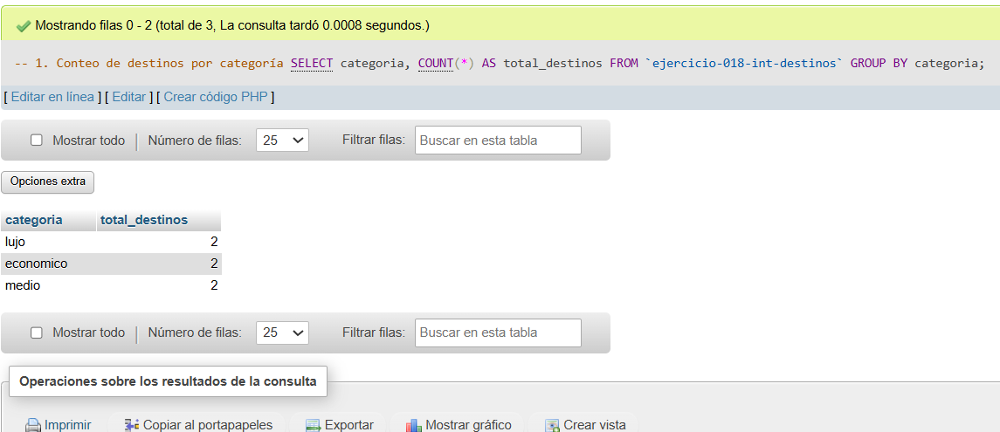
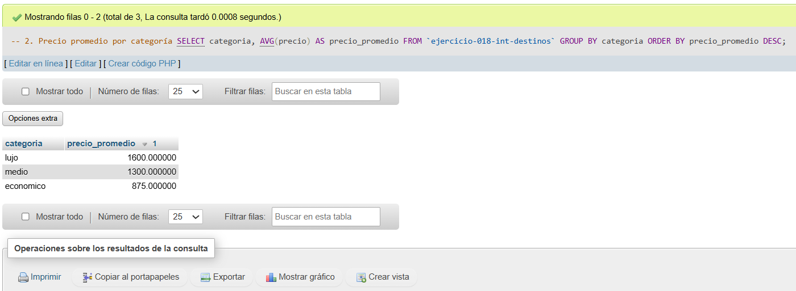
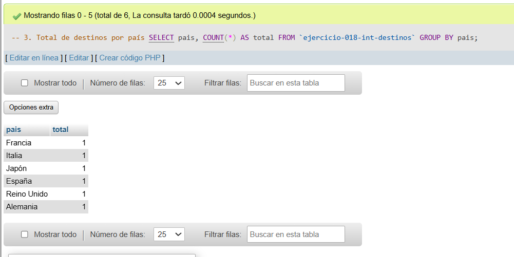

# Ejercicio 018 - Nivel Intermedio - GROUP BY Viajes y Turismo

## 1. Temática

Viajes y turismo con GROUP BY para agrupar destinos por categoría y país.

## 2. Decisiones Técnicas

- **Diseño de Tablas (DDL):**
  - Una tabla: `ejercicio-018-int-destinos`.
  - Columnas: `id`, `ciudad`, `pais`, `precio`, `categoria`.
  - PRIMARY KEY en `id` con AUTO_INCREMENT.
  - Uso de comillas invertidas para nombres con guiones.

- **Inserción de Datos (DML):**
  - 6 destinos con diferentes categorías y precios.

- **Consultas (DQL):**
  - La consulta `1` agrupa por categoría y cuenta destinos.
  - La consulta `2` calcula precio promedio por categoría.
  - La consulta `3` cuenta destinos por país.

## 3. Evidencias

<!-- Capturas aquí -->

*A continuación, se adjuntan capturas de pantalla que demuestran la ejecución y los resultados de los scripts SQL en phpMyAdmin.*

Definición de tablas e inserción de datos

Consulta 1

Consulta 2

Consulta 3

