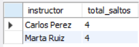
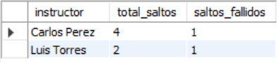
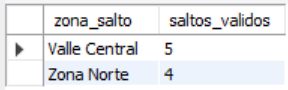
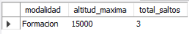

# Ejercicio Intermedio 019 - HAVING

**Camper:** Antonio Canux

## Descripción

Decimonoveno ejercicio de nivel intermedio, enfocado en un módulo de datos de paracaidismo. El objetivo central de esta práctica es dominar la cláusula **`HAVING`** en MySQL. A nivel profesional, es vital entender la diferencia de ejecución en el motor SQL: `WHERE` filtra filas individuales *antes* de que ocurra la agrupación (`GROUP BY`), mientras que `HAVING` filtra los grupos resultantes *después* de que las funciones matemáticas (como `COUNT`, `AVG`, `SUM`) hayan sido calculadas.

---

## Tabla utilizada

**intermedio_ejercicio_019_saltos**
- id (PK)
- instructor
- zona_salto
- modalidad (ENUM)
- altitud_pies
- exitoso (BOOLEAN)
- fecha_salto

---

## Consultas realizadas

### 1. ¿Qué instructores han liderado estrictamente más de 3 saltos en total?

```sql
SELECT instructor, COUNT(id) AS total_saltos
    FROM intermedio_ejercicio_019_saltos
    GROUP BY instructor
    HAVING total_saltos > 3
    ORDER BY total_saltos DESC;
```

**Resultado**



---

### 2. ¿En qué zonas de salto la altitud promedio histórica supera los 11,000 pies?

```sql
SELECT zona_salto, ROUND(AVG(altitud_pies), 0) AS altitud_promedio
    FROM intermedio_ejercicio_019_saltos
    GROUP BY zona_salto
    HAVING altitud_promedio > 11000
    ORDER BY altitud_promedio DESC;
```

**Resultado**


---

### 3. ¿Qué instructores registran al menos 1 salto no exitoso (incidencia) en su historial?

```sql
SELECT instructor, COUNT(id) AS total_saltos, SUM(CASE WHEN exitoso = FALSE THEN 1 ELSE 0 END) AS saltos_fallidos
    FROM intermedio_ejercicio_019_saltos
    GROUP BY instructor
    HAVING saltos_fallidos > 0
    ORDER BY saltos_fallidos DESC;
```

**Resultado**



---

### 4. Excluyendo los saltos 'Base', ¿qué zonas mantienen un volumen superior a 2 saltos registrados?

```sql
SELECT zona_salto, COUNT(id) AS saltos_validos
    FROM intermedio_ejercicio_019_saltos
    WHERE modalidad != 'Base'
    GROUP BY zona_salto
    HAVING saltos_validos > 2
    ORDER BY saltos_validos DESC;
```

**Resultado**



---

### 5. ¿Qué modalidades han registrado una altitud máxima de 14,000 pies o superior?

```sql
SELECT modalidad, MAX(altitud_pies) AS altitud_maxima, COUNT(id) AS total_saltos
    FROM intermedio_ejercicio_019_saltos
    GROUP BY modalidad
    HAVING altitud_maxima >= 14000
    ORDER BY altitud_maxima DESC;
```

**Resultado**



---

## Herramientas

- MySQL
- MySQL Workbench
- Git
- GitHub

---

**Campuslands · Skill SQL**