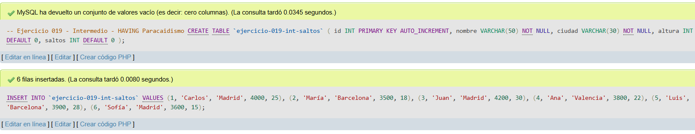
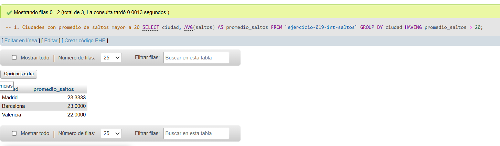
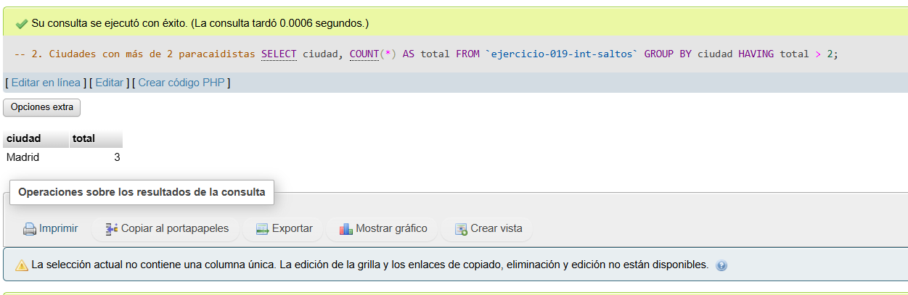
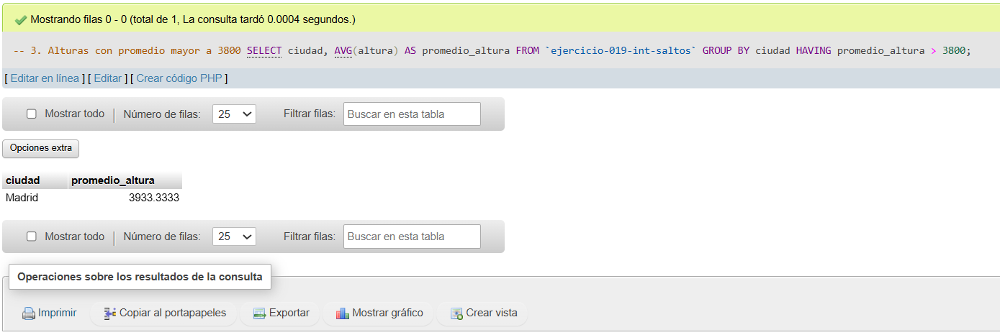

# Ejercicio 019 - Nivel Intermedio - HAVING Paracaidismo

## 1. Temática

Paracaidismo con HAVING para filtrar resultados agrupados por ciudad.

## 2. Decisiones Técnicas

- **Diseño de Tablas (DDL):**
  - Una tabla: `ejercicio-019-int-saltos`.
  - Columnas: `id`, `nombre`, `ciudad`, `altura`, `saltos`.
  - PRIMARY KEY en `id` con AUTO_INCREMENT.
  - Uso de comillas invertidas para nombres con guiones.

- **Inserción de Datos (DML):**
  - 6 paracaidistas de diferentes ciudades.

- **Consultas (DQL):**
  - La consulta `1` usa HAVING con AVG para filtrar ciudades con promedio de saltos > 20.
  - La consulta `2` usa HAVING con COUNT para filtrar ciudades con más de 2 paracaidistas.
  - La consulta `3` usa HAVING con AVG para filtrar ciudades con promedio de altura > 3800.

## 3. Evidencias

<!-- Capturas aquí -->

*A continuación, se adjuntan capturas de pantalla que demuestran la ejecución y los resultados de los scripts SQL en phpMyAdmin.*

Definición de tablas e inserción de datos

Consulta 1

Consulta 2

Consulta 3

