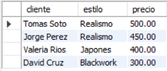
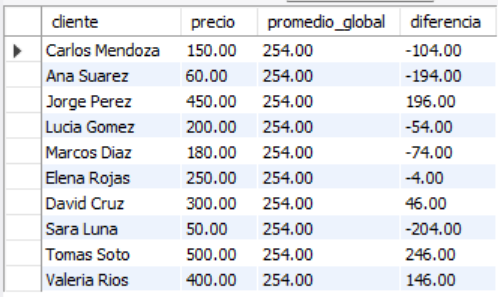
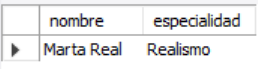
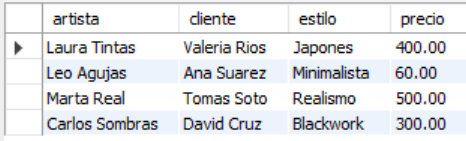
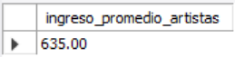

# Ejercicio Intermedio 020 - Subconsultas (Subqueries)

**Camper:** Antonio Canux

## Descripción

Vigésimo ejercicio de nivel intermedio, enfocado en un módulo de datos para un estudio de tatuajes. El objetivo técnico central es dominar las **Subconsultas (Subqueries)**. Una subconsulta es una consulta anidada dentro de otra instrucción SQL (SELECT, INSERT, UPDATE o DELETE). A nivel profesional, son fundamentales para realizar comparaciones dinámicas (como comparar un registro contra el promedio general sin tener que calcular el promedio de antemano) o para pre-procesar datos en memoria creando "tablas derivadas" al vuelo.

---

## Tablas utilizadas

**intermedio_ejercicio_020_artistas**
- id (PK)
- nombre
- especialidad

**intermedio_ejercicio_020_tatuajes**
- id (PK)
- artista_id (FK)
- cliente
- estilo (ENUM)
- precio
- fecha_sesion

---

## Consultas realizadas

### 1. Subconsulta Escalar en WHERE: ¿Qué tatuajes cuestan más que el promedio global del estudio?

```sql
SELECT cliente, estilo, precio
    FROM intermedio_ejercicio_020_tatuajes
    WHERE precio > (SELECT AVG(precio) 
        FROM intermedio_ejercicio_020_tatuajes)
    ORDER BY precio DESC;
```

**Resultado**



---

### 2. Subconsulta en SELECT: ¿Cómo comparar fila por fila el costo de un tatuaje vs el promedio general?

```sql
SELECT cliente, precio, (SELECT ROUND(AVG(precio), 2) 
            FROM intermedio_ejercicio_020_tatuajes) AS promedio_global,
        ROUND(precio - (SELECT AVG(precio) 
            FROM intermedio_ejercicio_020_tatuajes), 2) AS diferencia
    FROM intermedio_ejercicio_020_tatuajes;
```

**Resultado**



---

### 3. Subconsulta de Lista (IN): ¿Qué artistas han ejecutado tatuajes de estilo 'Realismo' o 'Acuarela'?

```sql
SELECT nombre, especialidad
    FROM intermedio_ejercicio_020_artistas
    WHERE id IN (
        SELECT DISTINCT artista_id 
        FROM intermedio_ejercicio_020_tatuajes 
        WHERE estilo IN ('Realismo', 'Acuarela')
);
```

**Resultado**



---

### 4. Subconsulta Correlacionada: ¿Cuál es el tatuaje más caro en el historial de CADA artista individualmente?

```sql
SELECT a.nombre AS artista, t.cliente, t.estilo, t.precio
    FROM intermedio_ejercicio_020_tatuajes t
    JOIN intermedio_ejercicio_020_artistas a ON t.artista_id = a.id
    WHERE t.precio = (
        SELECT MAX(precio) 
        FROM intermedio_ejercicio_020_tatuajes t2 
        WHERE t2.artista_id = t.artista_id
);
```

**Resultado**



---

### 5. Subconsulta en FROM (Tabla Derivada): ¿Cuál es el ingreso promedio si evaluamos lo generado por cada artista de forma aislada?

```sql
SELECT ROUND(AVG(ingreso_total), 2) AS ingreso_promedio_artistas
    FROM (
        SELECT artista_id, SUM(precio) AS ingreso_total
        FROM intermedio_ejercicio_020_tatuajes
        GROUP BY artista_id
) AS ingresos_por_artista;
```

**Resultado**



---

## Herramientas

- MySQL
- MySQL Workbench
- Git
- GitHub

---

**Campuslands · Skill SQL**