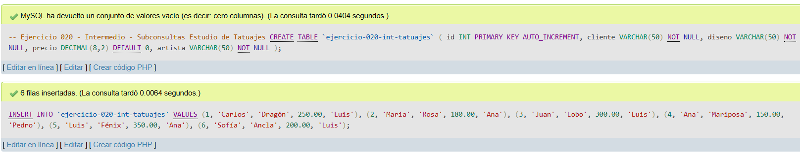
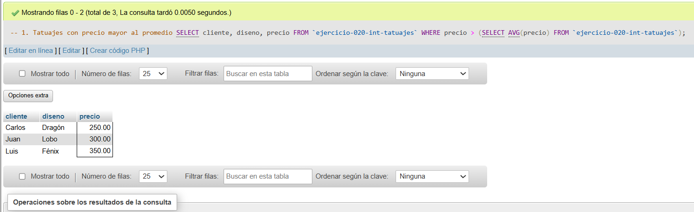
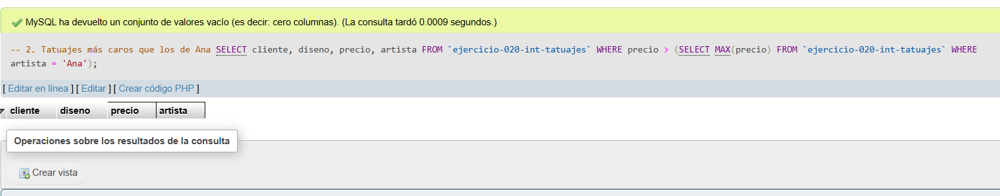
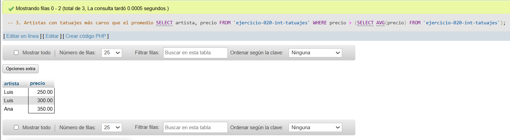

# Ejercicio 020 - Nivel Intermedio - Subconsultas Estudio de Tatuajes

## 1. Temática

Estudio de tatuajes con subconsultas para comparar precios.

## 2. Decisiones Técnicas

- **Diseño de Tablas (DDL):**
  - Una tabla: `ejercicio-020-int-tatuajes`.
  - Columnas: `id`, `cliente`, `diseno`, `precio`, `artista`.
  - PRIMARY KEY en `id` con AUTO_INCREMENT.
  - Uso de comillas invertidas para nombres con guiones.

- **Inserción de Datos (DML):**
  - 6 tatuajes con diferentes precios y artistas.

- **Consultas (DQL):**
  - La consulta `1` usa subconsulta con AVG para filtrar precio mayor al promedio.
  - La consulta `2` usa subconsulta con MAX para filtrar más caro que los de Ana.
  - La consulta `3` usa subconsulta con AVG para mostrar artistas con precios mayores al promedio.

## 3. Evidencias

<!-- Capturas aquí -->

*A continuación, se adjuntan capturas de pantalla que demuestran la ejecución y los resultados de los scripts SQL en phpMyAdmin.*

Definición de tablas e inserción de datos

Consulta 1

Consulta 2

Consulta 3

