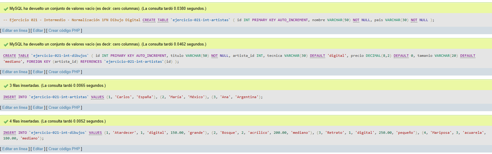
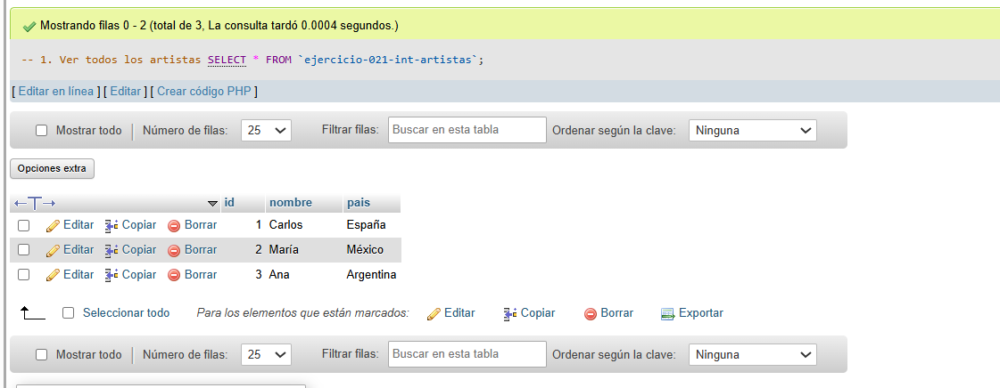
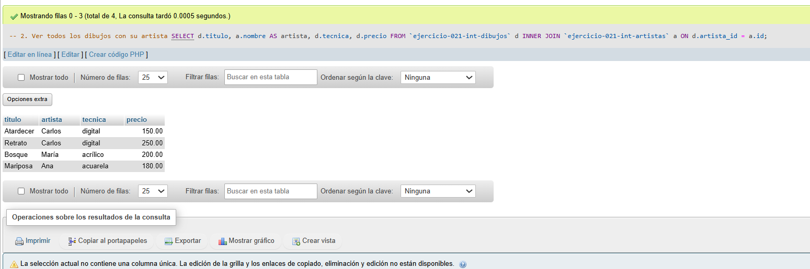
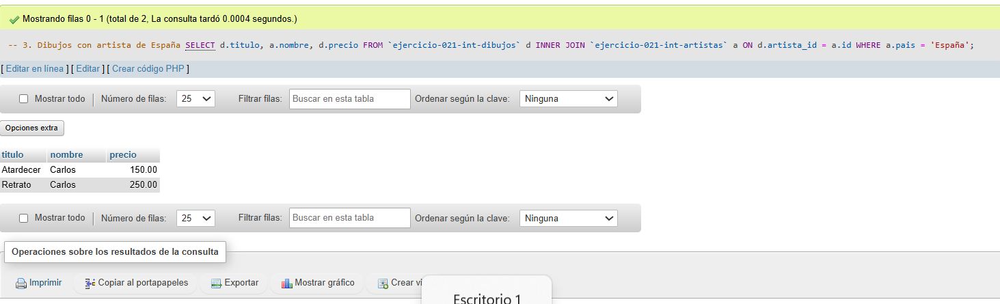

# Ejercicio 021 - Nivel Intermedio - Normalización 1FN Dibujo Digital

## 1. Temática

Dibujo digital con normalización 1FN separando artistas en tabla independiente.

## 2. Decisiones Técnicas

- **Diseño de Tablas (DDL):**
  - Tabla de artistas: `ejercicio-021-int-artistas`.
  - Tabla de dibujos: `ejercicio-021-int-dibujos`.
  - FOREIGN KEY en `artista_id` → `artistas(id)`.
  - Uso de comillas invertidas para nombres con guiones.

- **Inserción de Datos (DML):**
  - 3 artistas con países.
  - 4 dibujos relacionados con artistas.

- **Consultas (DQL):**
  - La consulta `1` muestra todos los artistas.
  - La consulta `2` muestra dibujos con su artista usando INNER JOIN.
  - La consulta `3` filtra dibujos de artistas de España.

## 3. Evidencias

<!-- Capturas aquí -->

*A continuación, se adjuntan capturas de pantalla que demuestran la ejecución y los resultados de los scripts SQL en phpMyAdmin.*

Definición de tablas e inserción de datos

Consulta 1

Consulta 2

Consulta 3

