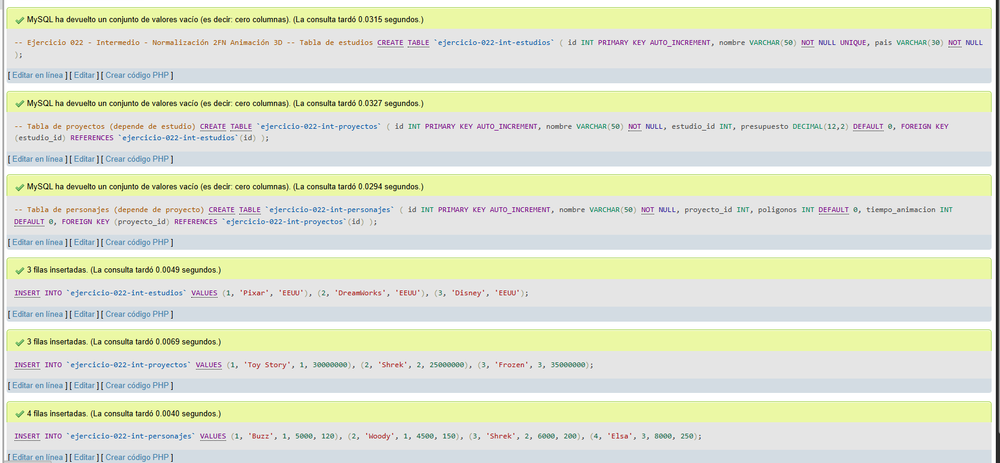
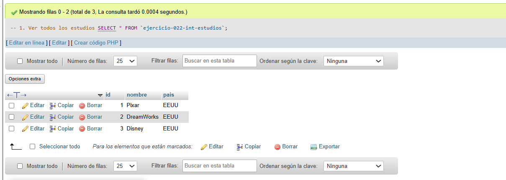
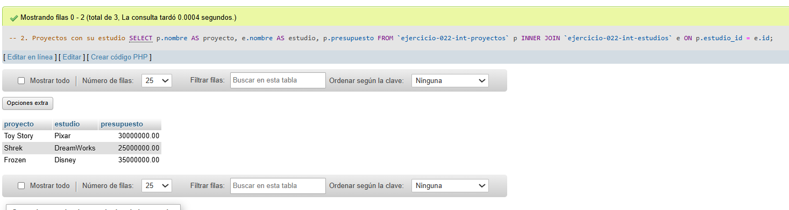
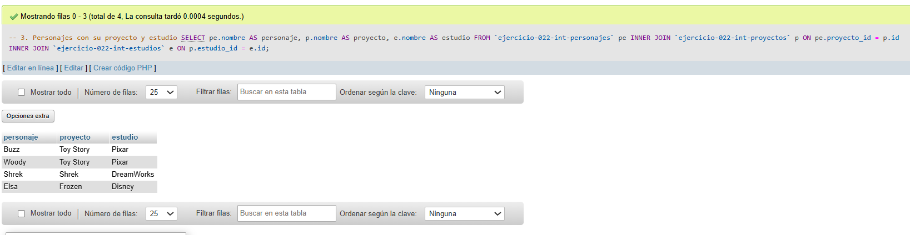

# Ejercicio 022 - Nivel Intermedio - Normalización 2FN Animación 3D

## 1. Temática

Animación 3D con normalización 2FN separando estudios, proyectos y personajes.

## 2. Decisiones Técnicas

- **Diseño de Tablas (DDL):**
  - Tabla de estudios: `ejercicio-022-int-estudios`.
  - Tabla de proyectos: `ejercicio-022-int-proyectos`.
  - Tabla de personajes: `ejercicio-022-int-personajes`.
  - FOREIGN KEY en `estudio_id` y `proyecto_id`.
  - Uso de comillas invertidas para nombres con guiones.

- **Inserción de Datos (DML):**
  - 3 estudios, 3 proyectos, 4 personajes.

- **Consultas (DQL):**
  - La consulta `1` muestra todos los estudios.
  - La consulta `2` muestra proyectos con su estudio.
  - La consulta `3` muestra personajes con su proyecto y estudio.

## 3. Evidencias

<!-- Capturas aquí -->

*A continuación, se adjuntan capturas de pantalla que demuestran la ejecución y los resultados de los scripts SQL en phpMyAdmin.*

Definición de tablas e inserción de datos

Vista 1

Vista 2

Vista 3

