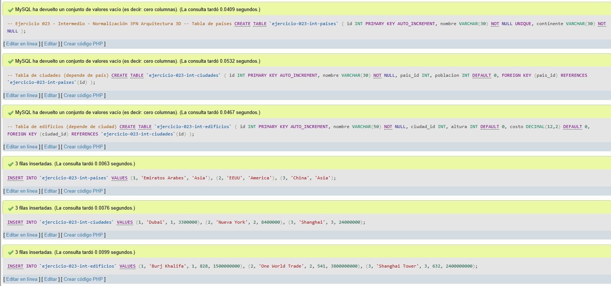
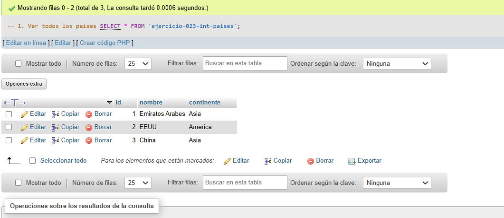
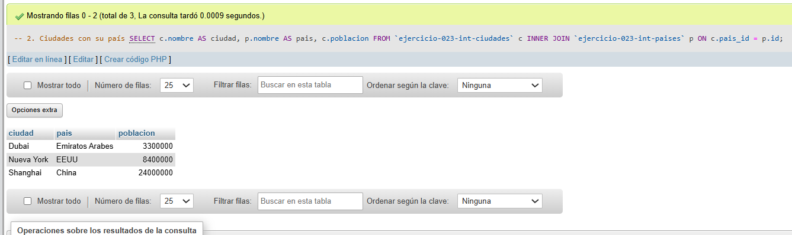
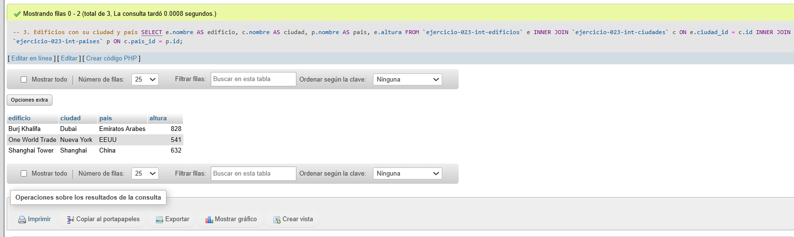

# Ejercicio 023 - Nivel Intermedio - Normalización 3FN Arquitectura 3D

## 1. Temática

Arquitectura 3D con normalización 3FN para eliminar dependencias transitivas.

## 2. Decisiones Técnicas

- **Diseño de Tablas (DDL):**
  - Tabla de países: `ejercicio-023-int-paises`.
  - Tabla de ciudades: `ejercicio-023-int-ciudades`.
  - Tabla de edificios: `ejercicio-023-int-edificios`.
  - FOREIGN KEY en `pais_id` y `ciudad_id`.
  - Uso de comillas invertidas para nombres con guiones.

- **Inserción de Datos (DML):**
  - 3 países, 3 ciudades, 3 edificios.

- **Consultas (DQL):**
  - La consulta `1` muestra todos los países.
  - La consulta `2` muestra ciudades con su país.
  - La consulta `3` muestra edificios con su ciudad y país.

## 3. Evidencias

<!-- Capturas aquí -->

*A continuación, se adjuntan capturas de pantalla que demuestran la ejecución y los resultados de los scripts SQL en phpMyAdmin.*

Definición de tablas e inserción de datos

Consulta 1

Consulta 2

Consulta 3

