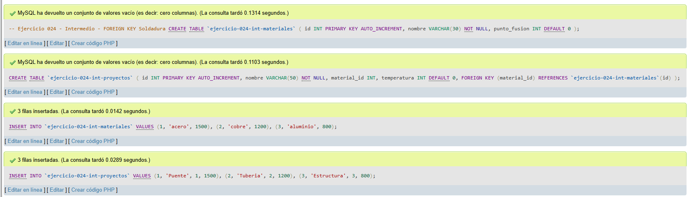
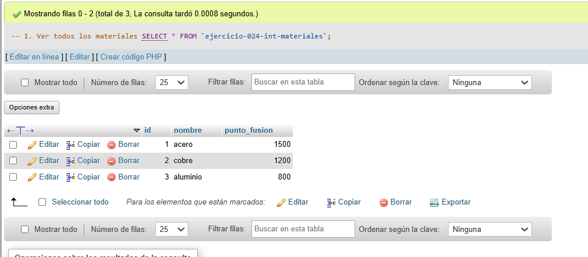
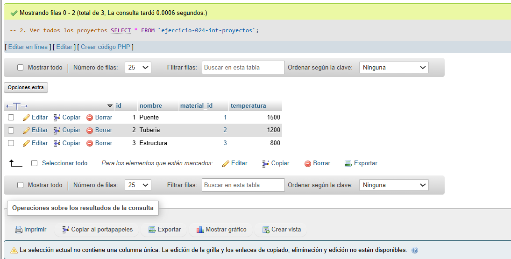
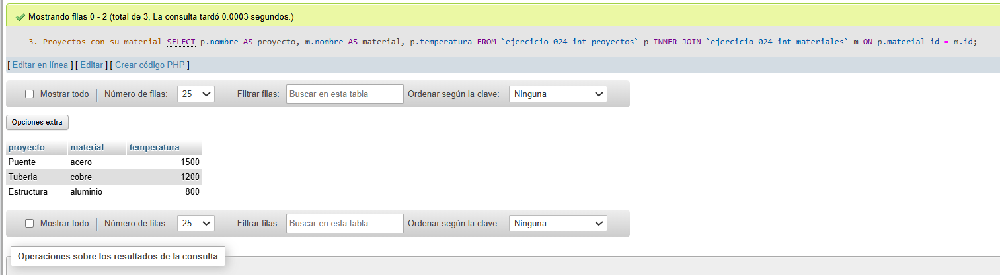

# Ejercicio 024 - Nivel Intermedio - FOREIGN KEY Soldadura

## 1. Temática

Soldadura con FOREIGN KEY para relacionar proyectos con materiales.

## 2. Decisiones Técnicas

- **Diseño de Tablas (DDL):**
  - Tabla de materiales: `ejercicio-024-int-materiales`.
  - Tabla de proyectos: `ejercicio-024-int-proyectos`.
  - FOREIGN KEY en `material_id` → `materiales(id)`.
  - Uso de comillas invertidas para nombres con guiones.

- **Inserción de Datos (DML):**
  - 3 materiales con puntos de fusión.
  - 3 proyectos relacionados.

- **Consultas (DQL):**
  - La consulta `1` muestra todos los materiales.
  - La consulta `2` muestra todos los proyectos.
  - La consulta `3` usa INNER JOIN para mostrar proyectos con su material.

## 3. Evidencias

<!-- Capturas aquí -->

*A continuación, se adjuntan capturas de pantalla que demuestran la ejecución y los resultados de los scripts SQL en phpMyAdmin.*

Definición de tablas e inserción de datos

Consulta 1

Consulta 2

Consulta 3

