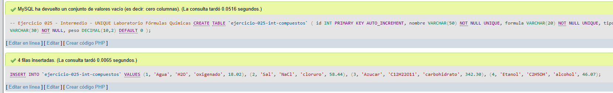
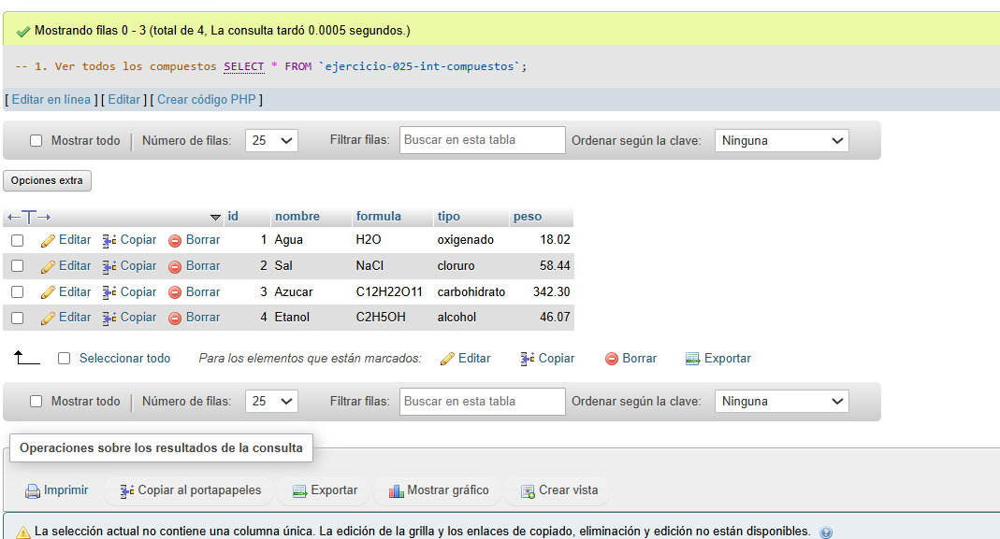
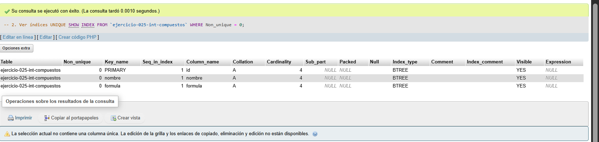
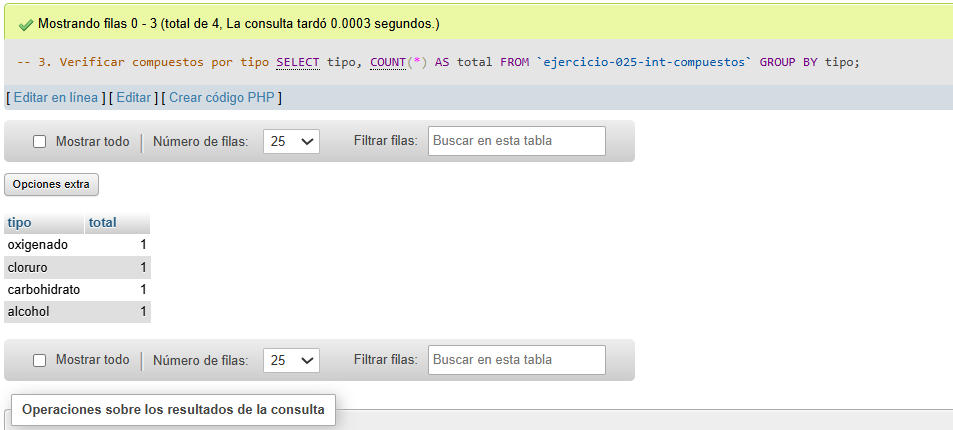

# Ejercicio 025 - Nivel Intermedio - UNIQUE Laboratorio Fórmulas Químicas

## 1. Temática

Laboratorio de fórmulas químicas con UNIQUE para evitar duplicados en nombre y fórmula.

## 2. Decisiones Técnicas

- **Diseño de Tablas (DDL):**
  - Una tabla: `ejercicio-025-int-compuestos`.
  - Columnas: `id`, `nombre`, `formula`, `tipo`, `peso`.
  - UNIQUE en `nombre` y `formula`.
  - PRIMARY KEY en `id` con AUTO_INCREMENT.
  - Uso de comillas invertidas para nombres con guiones.

- **Inserción de Datos (DML):**
  - 4 compuestos con nombres y fórmulas únicas.

- **Consultas (DQL):**
  - La consulta `1` muestra todos los compuestos.
  - La consulta `2` muestra los índices UNIQUE.
  - La consulta `3` agrupa compuestos por tipo.

## 3. Evidencias

<!-- Capturas aquí -->

*A continuación, se adjuntan capturas de pantalla que demuestran la ejecución y los resultados de los scripts SQL en phpMyAdmin.*

Definición de tablas e inserción de datos

Consulta 1

Consulta 2

Consulta 3

