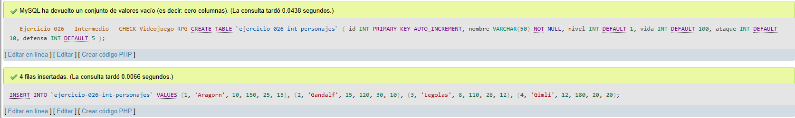
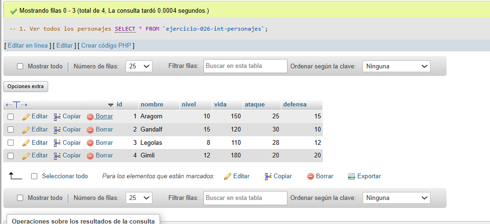
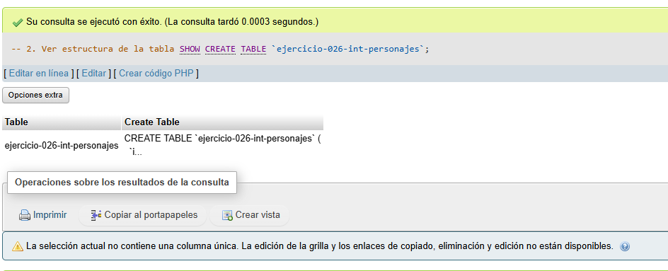
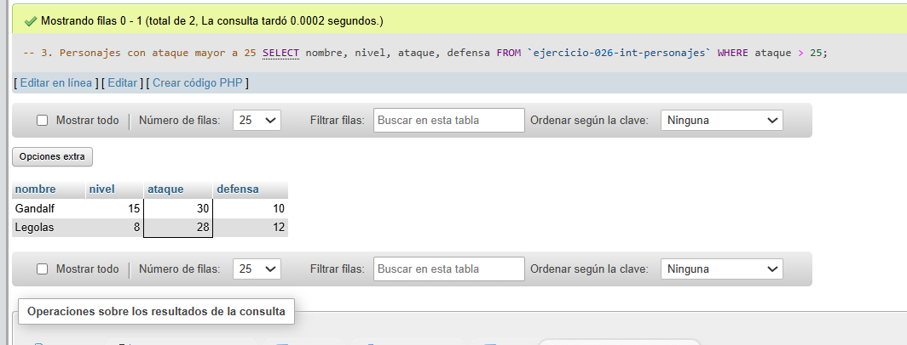

# Ejercicio 026 - Nivel Intermedio - CHECK Videojuego RPG

## 1. Temática

Videojuego RPG con validaciones de datos (CHECK no soportado en algunas versiones de MySQL).

## 2. Decisiones Técnicas

- **Diseño de Tablas (DDL):**
  - Una tabla: `ejercicio-026-int-personajes`.
  - Columnas: `id`, `nombre`, `nivel`, `vida`, `ataque`, `defensa`.
  - PRIMARY KEY en `id` con AUTO_INCREMENT.
  - Uso de comillas invertidas para nombres con guiones.
  - Las validaciones se aplican desde la aplicación.

- **Inserción de Datos (DML):**
  - 4 personajes con atributos válidos.

- **Consultas (DQL):**
  - La consulta `1` muestra todos los personajes.
  - La consulta `2` muestra la estructura de la tabla.
  - La consulta `3` filtra personajes con ataque mayor a 25.

## 3. Evidencias

<!-- Capturas aquí -->

*A continuación, se adjuntan capturas de pantalla que demuestran la ejecución y los resultados de los scripts SQL en phpMyAdmin.*

Definición de tablas e inserción de datos

Consulta 1

Consulta 2

Consulta 3

