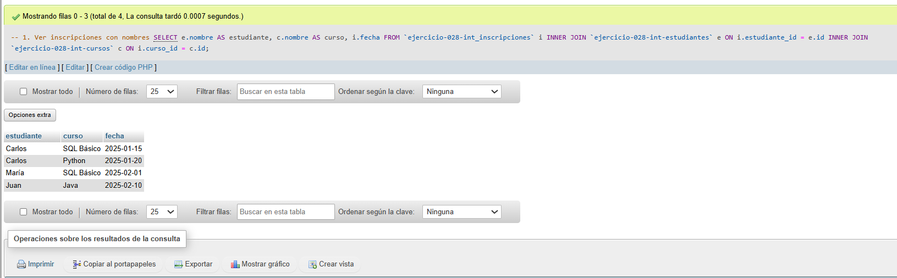
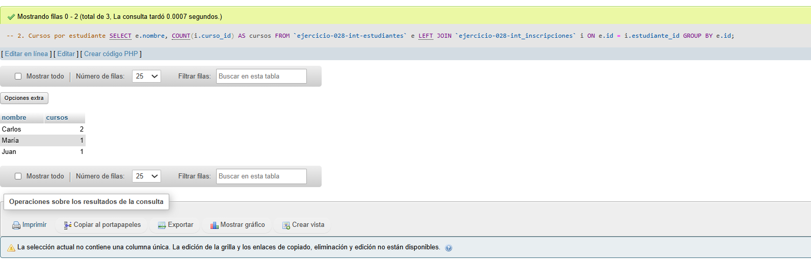
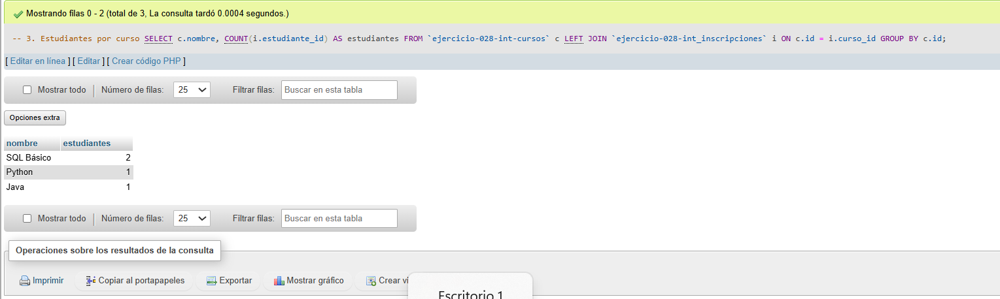

# Ejercicio 028 - Nivel Intermedio - Tablas Puente Academia Tech

## 1. Temática

Academia tech con tablas puente para relación muchos a muchos entre estudiantes y cursos.

## 2. Decisiones Técnicas

- **Diseño de Tablas (DDL):**
  - Tabla de estudiantes: `ejercicio-028-int-estudiantes`.
  - Tabla de cursos: `ejercicio-028-int-cursos`.
  - Tabla puente: `ejercicio-028-int_inscripciones`.
  - FOREIGN KEY en `estudiante_id` y `curso_id`.
  - UNIQUE en `email`.
  - Uso de comillas invertidas para nombres con guiones.

- **Inserción de Datos (DML):**
  - 3 estudiantes, 3 cursos, 4 inscripciones.

- **Consultas (DQL):**
  - La consulta `1` muestra inscripciones con nombres.
  - La consulta `2` cuenta cursos por estudiante.
  - La consulta `3` cuenta estudiantes por curso.

## 3. Evidencias

<!-- Capturas aquí -->

*A continuación, se adjuntan capturas de pantalla que demuestran la ejecución y los resultados de los scripts SQL en phpMyAdmin.*

Definición de tablas e inserción de datos

Consulta 1

Consulta 2

Consulta 3

