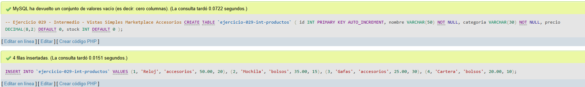
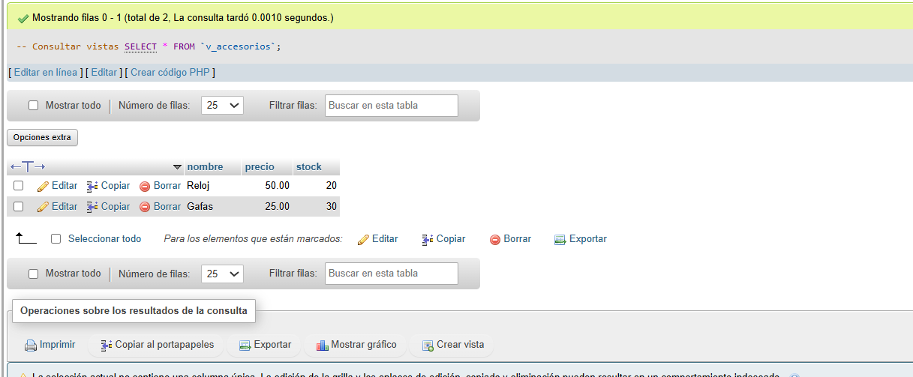
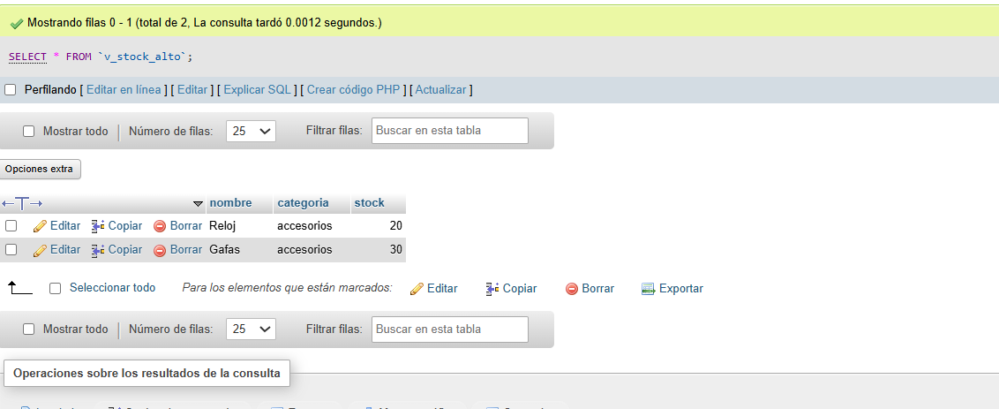

# Ejercicio 029 - Nivel Intermedio - Vistas Simples Marketplace Accesorios

## 1. Temática

Marketplace de accesorios con vistas simples para consultas frecuentes.

## 2. Decisiones Técnicas

- **Diseño de Tablas (DDL):**
  - Una tabla: `ejercicio-029-int-productos`.
  - Columnas: `id`, `nombre`, `categoria`, `precio`, `stock`.
  - PRIMARY KEY en `id` con AUTO_INCREMENT.
  - Uso de comillas invertidas para nombres con guiones.

- **Inserción de Datos (DML):**
  - 4 productos de diferentes categorías.

- **Vistas creadas:**
  - `v_accesorios`: Productos de categoría accesorios.
  - `v_stock_alto`: Productos con stock mayor a 15.

- **Consultas (DQL):**
  - Consultas SELECT desde las vistas creadas.

## 3. Evidencias

<!-- Capturas aquí -->

*A continuación, se adjuntan capturas de pantalla que demuestran la ejecución y los resultados de los scripts SQL en phpMyAdmin.*

Definición de tablas e inserción de datos

Vista 1

Vista 2

