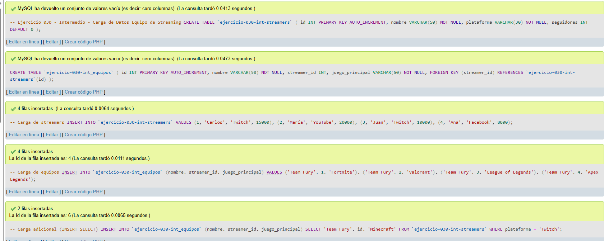
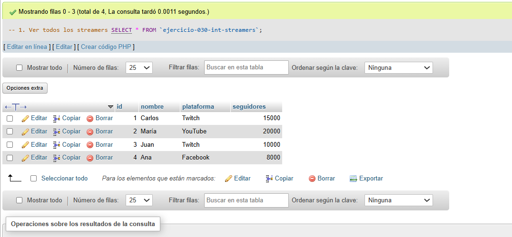
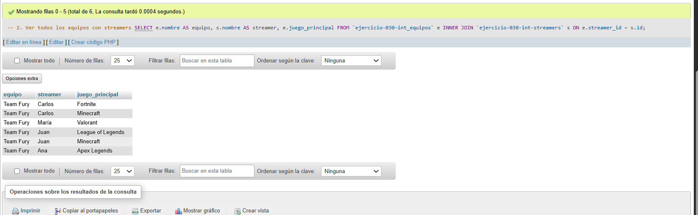
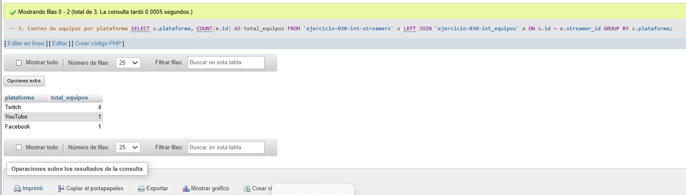

# Ejercicio 030 - Nivel Intermedio - Carga de Datos Equipo de Streaming

## 1. Temática

Equipo de streaming con carga de datos usando diferentes métodos de INSERT.

## 2. Decisiones Técnicas

- **Diseño de Tablas (DDL):**
  - Tabla de streamers: `ejercicio-030-int-streamers`.
  - Tabla de equipos: `ejercicio-030-int_equipos`.
  - FOREIGN KEY en `streamer_id` → `streamers(id)`.
  - Uso de comillas invertidas para nombres con guiones.

- **Métodos de carga:**
  - INSERT básico.
  - INSERT con columnas específicas.
  - INSERT SELECT para carga desde otra tabla.

- **Inserción de Datos (DML):**
  - 4 streamers de diferentes plataformas.
  - 4 equipos iniciales + 2 adicionales con INSERT SELECT.

- **Consultas (DQL):**
  - La consulta `1` muestra todos los streamers.
  - La consulta `2` muestra equipos con streamers.
  - La consulta `3` cuenta equipos por plataforma.

## 3. Evidencias

<!-- Capturas aquí -->

*A continuación, se adjuntan capturas de pantalla que demuestran la ejecución y los resultados de los scripts SQL en phpMyAdmin.*

Definición de tablas e inserción de datos

Consulta 1

Consulta 2

Consulta 3

