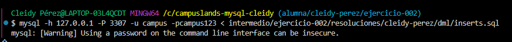
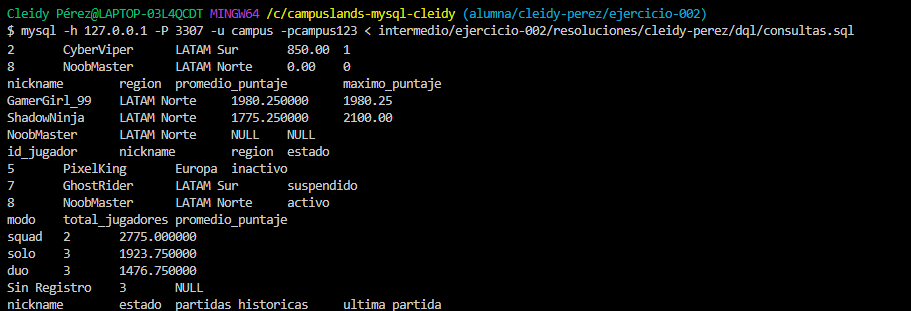

# Ejercicio 002 - LEFT JOIN para Ranking Battle Royale

**Estudiante:** Cleidy Pérez  
**Módulo:** MySQL Intermedio Inicial  

## 📌 Decisiones Técnicas
1. **Modelado Relacional:** Se definieron dos tablas (`jugadores` y `partidas`) con una relación de $1:N$.
2. **Uso de LEFT JOIN:** Nos permite incluir a todos los jugadores en las estadísticas del ranking, incluso a aquellos recién registrados que aún no tienen partidas acumuladas (`NULL`).
3. **Manejo de Nulos:** Se aplicó la función `COALESCE()` para mostrar valores entendibles (`0` o `'Sin Registro'`) en reportes donde la unión genera valores nulos.
4. **Tipos de Datos:** Se usó `DECIMAL(10,2)` para los puntajes garantizando precisión y `ENUM` para controlar los estados y modos de juego válidos.

### Evidencia en la terminal 
- SCHEMA


- INSERTAR


- CONSULTAS



## 🚀 Orden de Ejecución en Terminal

```bash
# 1. Crear base de datos y tablas
mysql -h 127.0.0.1 -P 3307 -u campus -pcampus123 < ddl/schema.sql

# 2. Cargar datos de prueba
mysql -h 127.0.0.1 -P 3307 -u campus -pcampus123 < dml/inserts.sql

# 3. Ejecutar consultas de análisis
mysql -h 127.0.0.1 -P 3307 -u campus -pcampus123 < dql/consultas.sql
